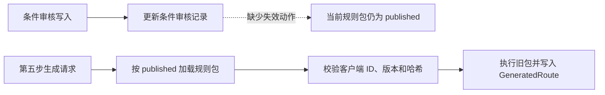
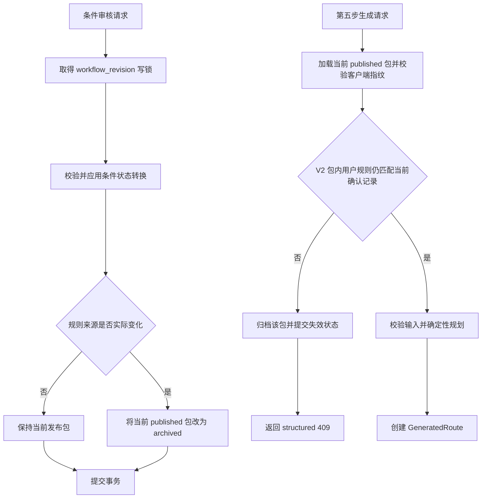

# R-001 条件修改后的发布包失效与执行校验设计

> - 日期：2026-08-06
> - 状态：已实施，验证通过
> - 跟踪条目：`R-001`
> - 影响范围：第四步条件审核、规则包生命周期、第五步 V2 执行

## 1. 背景

ProcessMind 第四步把数据库中的已确认条件编译为不可变 V2 规则包，第五步只允许执行当前 `published` 规则包。当前前端在条件发生变化后会立即把本地规则包标记为过期，但后端没有同步改变已发布包状态。

因此，前端当前页面虽然不再允许下载旧包，直接 API 调用、其他浏览器标签页或重新进入第五步仍可能加载并执行旧包。客户端提供的规则包 ID、版本和内容哈希只能证明请求仍指向数据库中的同一条发布记录，不能证明该记录仍与当前条件确认结果一致。

## 2. 当前架构与根因

### 2.1 当前写入链路

四个条件审核接口均位于 `app/routers/rule_packages.py`：

- `/rule-conditions/draft`
- `/rule-conditions/parse`
- `/rule-conditions/confirm`
- `/rule-conditions/manual`

路由已经负责工作流版本锁、提交、回滚和 HTTP 错误映射。`condition_review_service.py` 负责改变 `normalized_route_segment_rule_reviews`，但没有调用规则包生命周期服务。

条件原文变化或重新解析会通过 `new_draft_update()`、`parsing_update()` 清除：

- `condition_candidate_json`
- `condition_confirmed_json`
- 确认人和确认时间
- 旧置信度、问题和解析元数据

该写入已经使旧包的来源失去当前有效性，但 `finalized_rule_packages.status` 仍保持 `published`。

### 2.2 当前执行链路



`load_published_rule_package_for_execution()` 当前只完成两类检查：

1. 项目是否存在当前 `published` 规则包。
2. 客户端提供的 ID、版本和哈希是否与该记录一致。

它没有比较规则包中的 `user_confirmed` 规则与数据库中的当前确认记录。

### 2.3 可复用能力

项目已经具备以下实现基础：

1. `lifecycle.supersede_published_rule_packages()` 能批量转换当前发布状态，但 `superseded` 表示被新版本替代，不适合本场景。
2. `project_workflow_lifecycle.invalidate_project_workflow()` 在上游重置时使用 `archived` 表示没有替代版本的失效包。
3. `confirmation_validation.require_confirmed_user_rule_sources()` 已能校验包内 `user_confirmed` 规则和工序关系是否仍与服务端确认记录一致。
4. 前端已经识别结构化错误码 `published_rule_package_changed`，收到后会清除旧规则包上下文并重新加载。

## 3. 目标

1. 第四步条件语义发生实际变化后，服务端当前规则包立即变为不可执行。
2. 条件变化和规则包失效必须在同一事务内提交或回滚。
3. 第五步在执行前再次核对 V2 包内用户规则来源，防御历史数据、旁路写入或遗漏调用。
4. 旧包失效后，携带其正确指纹的请求仍返回结构化 `409`，且不创建 `GeneratedRoute`。
5. 无变化保存和解析缓存命中不应使当前包失效。
6. 保持 V2 规则包、KmAI V1 导出和数据库结构不变。

## 4. 非目标

- 不增加数据库列、触发器或迁移。
- 不修改 `factor_schema.json`、`factor_expansion_rules.json`、`route_catalog.json` 或 `route_rules.json` 的协议结构。
- 不改变内容哈希算法或重新编译已发布包。
- 不在本条目中拆分 `generate.py` 或 `FinalizeView.vue`。
- 不在本条目中统一 `segment-rule-reviews` 的事务所有权；该工作由 `R-003` 处理。
- 不删除历史 `GeneratedRoute`，也不重写项目状态。这里只阻止旧包继续驱动新的生成。
- 不用前端本地状态替代服务端有效性判断。

## 5. 方案比较与决策

| 方案 | 优点 | 缺点 | 结论 |
| --- | --- | --- | --- |
| 只在条件写入时归档 | 改动小；最新包接口立即反映失效 | 无法防御历史脏数据和旁路写入 | 不单独采用 |
| 只在执行时比较来源 | 执行安全边界集中 | 最新包、下载和兼容性测试仍会展示过期包 | 不采用 |
| 写入时归档 + 执行前来源校验 | 正常链路立即一致，同时具备防御性校验 | 多一个执行期数据库查询 | 采用 |

本设计采用第三种方案。

失效状态使用 `archived`，而不是 `superseded`：当前包失效时尚未发布替代版本；只有新版本真正发布后，旧发布版本才应使用 `superseded`。

## 6. 提议架构



### 6.1 生命周期服务

在 `app/services/rule_packages/lifecycle.py` 增加：

```python
async def archive_published_rule_packages(
    project_id: int,
    db: AsyncSession,
) -> list[int]:
    ...
```

职责：

1. 查询指定项目全部 `status="published"` 的规则包。
2. 把状态改为 `archived`。
3. `flush()` 当前会话，使同一事务后续读取看到失效状态。
4. 返回按升序排列的归档版本号，便于测试和后续状态接口复用。
5. 不提交、不回滚、不改变 `Project.status`，也不删除生成记录。

现有 `supersede_published_rule_packages()` 保持不变，继续服务于“被新数据或新版本替代”的既有链路。

### 6.2 条件审核失效规则

`condition_review_service.py` 在成功应用会改变规则来源的状态转换后调用生命周期服务。调用仍使用路由传入的同一 `AsyncSession`，由路由完成最终提交或回滚。

| 操作 | 触发归档 | 不触发归档 |
| --- | --- | --- |
| 保存草稿 | 规范化后的原文或来源哈希发生变化 | 原文和哈希均未变化，服务直接返回 |
| 准备解析 | 非缓存命中；进入 `parsing` 并清除旧确认 | 完整缓存命中，无持久化变化 |
| 完成解析 | 不重复归档；准备阶段已经完成失效 | 过期解析结果被丢弃 |
| 确认候选 | 校验成功并写入新的确认元数据 | 校验失败或来源冲突 |
| 人工设定 | 校验成功并写入人工确认 | 校验失败 |
| 自动修复旧审核 | 修复实际改变确认状态或确认 JSON | 扫描后没有变化 |

确认操作会更新确认人或确认时间，这些字段属于发布包的来源证明，而不是纯展示信息，因此成功确认后应使旧包失效。纯粹的读取、序列化、问题提示或前端展开状态不触发失效。

### 6.3 两阶段解析事务

解析继续保持现有的两阶段事务：

```text
事务 1：取得工作流锁 -> 写入 parsing 状态 -> 归档当前发布包 -> commit
事务外：调用解析器或 LLM
事务 2：再次取得工作流锁 -> 丢弃过期结果或写入候选 -> commit
```

旧包必须在事务 1 提交时失效。即使解析器随后失败，旧确认已经被清除，旧包也不能恢复为可执行状态。

### 6.4 执行期防御校验

`execution.py` 在客户端指纹通过后，对 V2 包执行以下检查：

1. 从持久化记录解析不可变 `RulePackageV2`。
2. 使用规则包自身的 `route_version_id` 和项目 ID 调用 `require_confirmed_user_rule_sources()`。
3. 对每条包内 `user_confirmed` 规则和工序关系，比较来源工序、原文、确认人、确认时间、条件 AST 和动作。
4. 发现不一致时，把当前包标记为 `archived` 并抛出类型化领域异常。

该校验只用于防御正常写入失效链路之外的异常状态。正常条件写入已经归档旧包，执行入口通常会在“没有当前发布包”阶段返回冲突。

V1 包没有等价的服务端确认来源元数据，因此只依赖写入时归档，不增加推测性的执行校验。

### 6.5 冲突响应

执行期发现来源变化时继续使用前端已经支持的稳定错误码：

```json
{
  "detail": {
    "code": "published_rule_package_changed",
    "message": "当前规则内容已变化，请返回第四步重新发布后再生成。",
    "current_rule_package": null
  }
}
```

`generate.py` 在规划和持久化之前捕获该领域异常，提交唯一允许的状态变化，也就是规则包归档，然后返回 `409`。如果归档提交失败，则回滚并保留真实服务端错误，不假装失效成功。

客户端指纹与另一个仍有效的新包不一致时，继续返回现有 `published_rule_package_changed` 响应，并在 `current_rule_package` 中提供新包指纹。

### 6.6 事务边界

| 链路 | 事务所有者 | 同一事务中的写入 |
| --- | --- | --- |
| 草稿、确认、人工设定 | `rule_packages.py` 路由 | 条件审核记录 + 当前包归档 |
| 解析准备 | `rule_packages.py` 路由第一阶段 | parsing 状态 + 当前包归档 |
| 解析完成 | `rule_packages.py` 路由第二阶段 | 候选结果或无变化 |
| 执行期发现过期 | `generate.py` 路由 | 当前包归档；不得写入生成结果 |

服务层可以 `add()`、修改 ORM 对象和 `flush()`，但不能 `commit()` 或 `rollback()`。

## 7. 文件边界

| 文件 | 变更职责 |
| --- | --- |
| `app/services/rule_packages/lifecycle.py` | 提供不提交事务的发布包归档函数 |
| `app/services/rule_packages/condition_review_service.py` | 在实际条件状态转换后协调归档 |
| `app/services/rule_packages/execution.py` | 执行前验证 V2 用户规则来源并抛出类型化冲突 |
| `app/routers/generate.py` | 提交防御性归档并映射结构化 `409` |
| `tests/test_rule_package_lifecycle.py` | 覆盖四类条件接口的归档与无变化行为 |
| `tests/test_generate_v2_production.py` | 覆盖旧指纹拒绝、执行期漂移和零持久化副作用 |
| `tests/test_condition_review_service.py` | 覆盖服务层不提交和失效调用边界 |

`app/services/project_rule_lifecycle.py` 当前没有实际调用方，并且会同时修改项目状态。本条目不复用或扩展它，避免把条件审核失效和项目资料重置混为同一职责。

前端现有本地过期提示保留，但仅作为即时交互反馈。服务端归档状态和执行校验是最终事实来源。

## 8. 测试设计

### 8.1 条件写入

1. 发布 V2 包后保存不同条件草稿，包状态变为 `archived`，最新包接口返回 404。
2. 保存完全相同的条件草稿不归档当前包。
3. 非缓存解析在提交 `parsing` 状态时归档当前包。
4. 完整缓存命中不归档当前包，也不调用解析器。
5. 成功确认候选和成功人工设定会归档当前包。
6. 校验失败、来源冲突或工作流版本冲突回滚后，包仍保持原状态。
7. 一个项目的条件变化不影响另一个项目的发布包。

### 8.2 执行防御

1. 通过旁路测试夹具制造“条件已变化但包仍为 published”的历史状态。
2. 携带该包正确指纹调用生成接口，返回 `409` 和 `published_rule_package_changed`。
3. 防御校验将异常包归档。
4. 不调用规划器，不创建 `GeneratedRoute`，不把项目状态改为新的生成成功状态。
5. 来源仍一致的 V2 包继续正常生成。
6. V1 当前行为和既有测试保持不变。

### 8.3 回归

- 规则包编译、发布、版本递增、下载和归档测试。
- V2 生产生成、输入校验和客户端指纹测试。
- 条件审核缓存、并发过期写保护和事务所有权测试。
- KmAI V1 导出、归档内容及兼容性测试。
- 后端全量测试。

## 9. 兼容性与风险

### 9.1 兼容性

- 无数据库迁移。
- 无请求字段或成功响应变化。
- 冲突响应复用现有错误码，当前前端无需新增识别逻辑。
- 历史规则包仍保留在版本列表中，仅状态变为 `archived`。
- 不修改 V2 内容哈希、归档 ZIP 和 KmAI V1 文件。

### 9.2 风险与控制

| 风险 | 控制 |
| --- | --- |
| 过度归档导致重复发布 | 只在实际状态转换后归档；无变化和缓存命中明确测试 |
| 条件写入成功但归档失败 | 同一事务回滚条件写入 |
| 防御校验归档后仍创建生成结果 | 校验位于规划和 `GeneratedRoute` 创建之前，并断言零副作用 |
| 多标签页同时写入 | 继续使用 `workflow_revision` 写锁，归档属于同一事务 |
| 状态语义混乱 | 无替代版本的失效统一使用 `archived`；新版本替代继续使用 `superseded` |
| V1 缺少确认来源元数据 | 只依赖写入时归档，保持原执行协议 |

## 10. 验收标准映射

| 跟踪项验收标准 | 设计落实 |
| --- | --- |
| 修改条件草稿后原包不能生成 | 草稿状态转换与包归档同事务提交 |
| 重新解析、确认、人工设定后原包不可执行 | 各成功状态转换统一调用归档生命周期 |
| 旧包正确指纹仍返回结构化 409 | 无当前包或来源防御校验均在规划前返回冲突 |
| 展示状态不应触发归档 | 只有持久化条件来源和确认转换触发 |
| 多标签页状态一致 | 最新包查询和执行均以服务端 `published` 状态为准 |
| V1 和 KmAI 内容不变化 | 不修改协议、哈希或归档构建器 |

## 11. 完成定义

1. 所有新增行为先通过失败测试复现，再实施最小代码修改。
2. 条件审核写入和规则包归档不存在部分提交。
3. 执行期来源漂移必定在规划前被拒绝。
4. 聚焦测试、后端全量测试和差异检查通过。
5. 总跟踪文档记录实际修改文件、验证命令、结果和剩余风险。
6. 未经明确授权不执行 Git 提交或推送。
