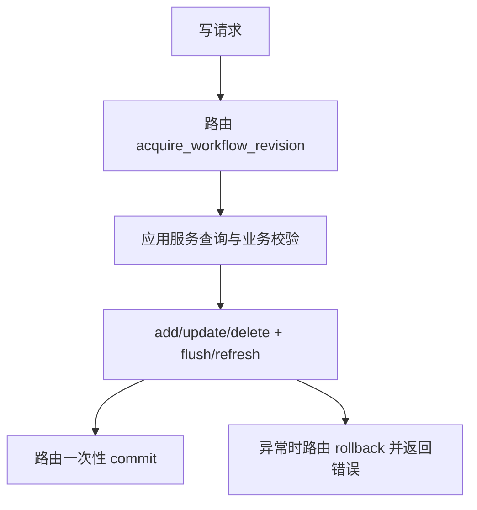

# R-003 派生路线写操作的事务和工作流版本统一设计

> - 日期：2026-08-06
> - 状态：已实施并验证
> - 跟踪条目：`R-003`
> - 影响范围：第二步路线归并、第三步标准化路线保存、规则审核写入
> - 验证：后端聚焦 `27 passed, 1 warning`；后端全量 `313 passed, 1 skipped, 1 warning`；前端全量 `125 passed`；生产构建成功

## 1. 背景

R-001 已为条件审核和规则包发布建立了路由拥有工作流锁、提交和回滚的模式。第二步路线归并和第三步标准化路线保存仍存在两类边界问题：

1. `route_analysis.py` 和 `route_merge/workspace.py` 内部直接 `commit()`，调用方无法把路线版本、审核记录、快照和发布包失效放进同一事务。
2. 标准化路线保存和归并建议审核请求没有携带 `expected_workflow_revision`，旧页面可能在工作流已被重置后继续写入。

## 2. 目标

1. 所有改变标准化路线、归并审核或下游规则来源的接口先校验并锁定 `workflow_revision`。
2. 应用服务和仓储只负责查询、业务校验、ORM 写入和 `flush/refresh`，不提交或回滚外层事务。
3. 路由在成功路径一次提交，异常路径一次回滚；失败请求不留下部分路线、审核、快照或规则包状态。
4. 保持现有成功响应、错误语义、V2/V1 规则包协议和 KmAI ZIP 内容不变。

## 3. 非目标

- 不引入通用 Unit of Work 或新的事务框架。
- 不在本条目扩展文档上传/删除和抽取后台任务的工作流版本契约。
- 不改变 `workflow_revision` 的递增规则；本条目统一校验和锁定现有版本。
- 不修改数据库结构、规则包 JSON、内容哈希或前端布局。

## 4. 方案决策

| 方案 | 优点 | 缺点 | 决策 |
| --- | --- | --- | --- |
| 路由显式锁定并统一提交 | 改动小，沿用 R-001 模式，事务边界清晰 | 少数路由需要显式补充回滚处理 | 采用 |
| 新增通用 Unit of Work 包装器 | 可减少重复代码 | 引入新抽象，响应和异常边界不一致 | 不采用 |
| 服务层参数化 `commit` | 兼容旧调用方 | 事务所有权仍分散，容易恢复内部提交 | 不采用 |

## 5. 提议架构



### 5.1 请求与路由边界

以下请求模型新增 `expected_workflow_revision: int = 0`：

- `SaveNormalizedSupersetRouteRequest`
- `MergeSuggestionReviewRequest`

以下接口在任何会产生写入的服务调用前锁定项目版本：

- `POST /api/extract/normalized-superset-route/save`
- `POST /api/extract/segment-rule-reviews`
- `POST /api/extract/merge-suggestions/review`

路由负责把 `HTTPException`、业务校验异常和未知异常映射为现有响应，并保证回滚。成功响应字段不变。

### 5.2 应用服务边界

移除以下服务中的内部 `commit()`/`rollback()`：

- `route_analysis.save_normalized_route_version`
- `route_analysis.ensure_saved_normalized_route_version`
- `route_analysis.save_segment_rule_review_record`
- `route_merge.workspace.ensure_route_merge_snapshot`
- `route_merge.workspace.persist_normalized_superset_route`

服务可以使用 `flush()` 获取新行 ID、触发约束并使当前会话可继续查询；需要序列化返回的数据时可以 `refresh()`，但不能结束外层事务。

可能在 GET 中重建快照或迁移旧审核数据的调用保持现有行为，由对应路由在服务返回后提交当前会话；纯读取路径提交为空事务，不改变业务数据。

### 5.3 前端契约

前端 API 类型和路线归并工作台调用新增并传递 `expected_workflow_revision`。版本来源使用当前项目列表或工作流数据中的 `workflow_revision`；服务端返回的成功字段不变。服务端返回 `409` 时保留结构化 `detail`，不通过匹配中文消息判断版本冲突。

## 6. 数据流与原子性

```text
标准化路线保存：锁版本
  -> 读取/必要时重建归并快照
  -> 保存归并快照
  -> 新建或复用标准化路线版本
  -> 路由提交

归并建议审核：锁版本
  -> 应用 accept/reject/rename/unsure
  -> 保存快照和审核状态
  -> 路由提交

规则审核写入：锁版本
  -> 保存或删除规则审核记录
  -> 路由提交
```

任一步骤失败都回滚同一会话中的所有变更。工作流版本不匹配时在服务写入前返回结构化 `409`，因此不产生部分更新。

## 7. 文件边界

| 文件 | 变更职责 |
| --- | --- |
| `process-plan-agent-api/app/schemas/schemas.py` | 增加两个写请求的工作流版本字段 |
| `process-plan-agent-api/app/routers/extract.py` | 写接口锁定版本、统一提交/回滚；读接口提交服务产生的缓存迁移 |
| `process-plan-agent-api/app/services/route_analysis.py` | 移除内部提交，改为 `flush/refresh` |
| `process-plan-agent-api/app/services/route_merge/workspace.py` | 移除快照构建和标准化路线保存的内部提交 |
| `process-plan-agent-api/tests/test_workflow_invalidation.py` | 旧版本冲突、路由原子性和无部分更新测试 |
| `process-plan-agent-api/tests/test_normalized_route_version_dedup.py` | 服务层调用者事务所有权和去重行为测试 |
| `process-plan-agent-ui/src/api/extract.ts` | 更新请求类型 |
| `process-plan-agent-ui/src/composables/useRouteMergeWorkspace.ts` | 保存、审核和批量操作携带工作流版本 |
| `process-plan-agent-ui/src/composables/useRouteMergeInteractionActions.ts` | 改名操作携带工作流版本 |
| `process-plan-agent-ui/src/views/ExtractView.vue` | 向路线归并 composable 提供当前项目版本 |
| `docs/重构与优化跟踪.md` | 记录 R-003 状态和验证结果 |

## 8. 测试设计

### 8.1 服务层事务所有权

1. `save_normalized_route_version()` 写入后在同一会话可读，调用方回滚后新会话看不到该版本。
2. 标准化路线去重、内容变化升版行为保持原有断言。
3. 归并快照重建和手工保存不在服务内部提交。
4. 规则审核服务 flush 后可序列化返回，提交由路由完成。

### 8.2 API 并发与原子性

1. 三类写请求携带旧 `expected_workflow_revision` 返回 `409`。
2. 版本冲突发生在任何写入前，路线、审核、快照和规则包状态保持不变。
3. 服务异常触发路由回滚，不留下新路线版本或半更新快照。
4. 正常请求仍返回现有响应结构。

### 8.3 前端契约

- API 请求类型检查通过。
- 路线归并保存、审核、批量确认和改名均带版本字段。
- 现有 Vitest 测试和生产构建通过。

## 9. 兼容性与风险

- 新增请求字段带默认值；未发送真实版本的旧页面在工作流已推进时会收到结构化 `409`，当前前端显式发送真实版本。
- 不改变成功响应结构和规则包文件内容。
- GET 路由可能为服务生成的缓存快照或旧审核迁移提交事务，但不新增业务写语义。
- SQLite 下工作流版本锁依赖现有条件更新和连接超时配置；并发回归测试必须覆盖实际 `409` 行为。

## 10. 完成标准

1. 三类路线相关写接口全部校验工作流版本并由路由拥有事务。
2. 相关服务无内部 `commit()`/`rollback()`。
3. 旧页面冲突返回结构化 `409`，失败不产生部分更新。
4. 后端聚焦测试、后端全量测试、前端测试和生产构建通过。
5. 跟踪文档记录实际变更文件、验证命令和未解决风险。
