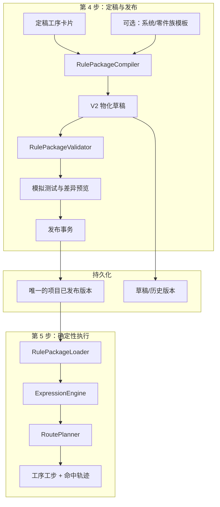
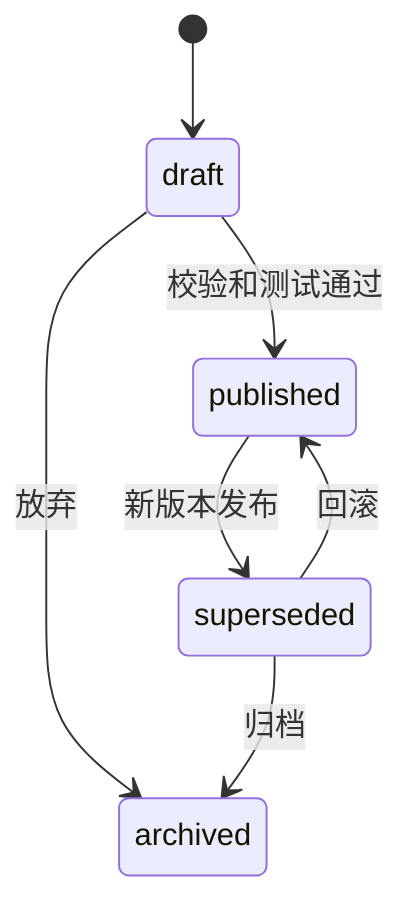

# 规则包 V2 通用化实施方案

> 状态：实施中（阶段 0–3 主体已完成；阶段 4 未开始）  
> 适用仓库：`processmind-minimal-runtime`  
> 目标读者：后端、前端、测试及工艺规则维护人员

### 当前实施进度（2026-07-15）

已完成：

- V1 后端生成行为基线测试和前端规则包构建基线测试。
- V2 严格 Pydantic 契约、结构化条件表达式引擎、规范化内容哈希。
- V2 输入校验、字段/工序引用校验、冲突校验、依赖环检测和包内测试执行。
- 基于稳定 `process_id` 的确定性规划、前置依赖补齐和拓扑排序。
- `POST /compile`、`POST /validate`、`POST /simulate` 三个不写数据库的预览接口。
- V2 草稿保存、发布、回滚和按 ID 模拟接口。
- 规则包状态迁移、内容哈希回填和每个项目唯一已发布版本。
- 第 4 步规则包生命周期面板。
- **阶段 3：** 第 4 步默认导出 V2 草稿（`compile` → 存 draft → ZIP）；保留「兼容导出 V1」。
- **阶段 3：** 第 5 步按 `schema_version=2.0` 的 `fields` 动态渲染，点号 key 嵌套提交。
- **阶段 3：** 已发布 V2 包走 `plan_route` 正式生成（`output_mode=finalized_rule_package_v2`），响应带 package 追溯字段。
- **阶段 3：** 项目级 `rule_engine=auto|v1|v2` 开关已接入第 4 步生命周期面板；默认 `auto`，可切 `v1` 临时回退旧规则路径。

尚未实施：

- 第 4 步模拟预览当前展示命中摘要；更细的结构化 trace 展示可继续增强。
- 跨项目模板库（阶段 4）。

阶段 1 的 `/simulate` 接收完整草稿包和输入；阶段 2 已增加持久化草稿和 `/{id}/simulate`，并保留前者用于无数据库预览。
## 1. 结论摘要

本方案不重写现有五步流程，而是在第 4 步“规则定稿”和第 5 步“路线生成”之间引入稳定的规则包 V2 契约。

V2 首先解决四个直接限制通用性的问题：

1. 输入字段及材料、特征候选值写死在前端。
2. 规则通过中文工序名称关联目录，改名可能造成误匹配或失效。
3. `when` 对象、`internal_factors` 字符串存在两套条件语义，部分因素只能展示、不能执行。
4. 新导出的最高版本立即被第 5 步使用，缺少草稿、发布、回滚和模拟验证。

最终运行路径保持简单：第 5 步只读取一个已经校验、合并并发布的项目级物化规则包，不在请求过程中动态合并模板。

## 2. 当前实现

### 2.1 当前数据流


### 2.2 现有代码职责

| 位置 | 当前职责 | 主要限制 |
| --- | --- | --- |
| `process-plan-agent-ui/src/utils/finalizeRulePackage.ts` | 构建输入字典、目录、规则、报告并进行前端校验 | 固定材料和特征写在 TypeScript；规则通过名称引用工序 |
| `process-plan-agent-ui/src/composables/useFinalizeRulePackageExport.ts` | 保存规则包并下载 ZIP | 导出即保存为可用的最高版本 |
| `process-plan-agent-api/app/models/models.py` | `FinalizedRulePackage` 持久化 | 没有状态、发布时间、内容哈希和契约版本字段 |
| `process-plan-agent-api/app/routers/extract.py` | 保存、查询最新版本、列出版本 | 只校验各部分非空；新版本自动生效 |
| `process-plan-agent-api/app/services/finalized_route_generator.py` | 解释规则包并生成路线 | 名称包含匹配、固定不可执行因素列表、固定四类规则循环 |
| `process-plan-agent-api/app/services/param_rule_expression.py` | 解析部分字符串条件 | 表达能力有限，尚未成为唯一条件模型 |
| `process-plan-agent-api/app/routers/generate.py` | 选择规则包、调用生成器、执行旧规则兜底 | 按最高版本选择，而不是按已发布版本选择 |
| `process-plan-agent-ui/src/composables/useGenerateInputFields.ts` | 根据 `input_schema` 渲染表单 | 可继续复用，但需要支持 V2 通用字段定义 |

### 2.3 当前规则包载荷

当前下载包包含：

- `input_schema.json`
- `factor_dictionary.json`
- `route_catalog.json`
- `route_rules.json`
- `rule_report.md`

数据库保存 `input_schema`、`route_catalog`、`route_rules`、`rule_report_md` 和 `validation_report`。`factor_dictionary` 同时嵌入前两类 JSON，因此不需要单独增加数据库列。

## 3. 目标与非目标

### 3.1 目标

- 新材料、新特征或新输入字段能够通过配置或项目数据加入，不修改路线生成代码。
- 所有规则使用稳定的 `process_id`，工序显示名变化不影响规则引用。
- 第 4 步校验、模拟和第 5 步执行使用同一个表达式引擎。
- 规则包版本不可变，草稿不会影响生产生成；发布和回滚有审计记录。
- V1 历史包和现有项目在迁移期内继续工作。
- 每次生成结果能够追溯到规则包 ID、版本和内容哈希。
- 后续能够复用企业级、零件族级模板，但运行时仍只执行项目级物化快照。

### 3.2 非目标

- 本轮不引入通用 BPMN/决策表平台。
- 本轮不把数据库从 SQLite 迁移到其他产品。
- 本轮不替换前 1 至 3 步的文档提取和工艺分析流程。
- 本轮不让大模型在第 5 步实时决定工序；生成结果必须由确定性规则产生。
- 第一阶段不实现多租户权限系统，仅保留 `created_by`、`published_by` 审计字段。

## 4. 目标架构



### 4.1 组件边界

| 组件 | 责任 | 不负责 |
| --- | --- | --- |
| `RulePackageCompiler` | 将定稿卡片、输入配置和可选模板编译为完整 V2 快照 | 不发布、不执行路线 |
| `RulePackageValidator` | 做结构、引用、表达式、依赖图和测试用例校验 | 不自动修正规则 |
| `ExpressionEngine` | 解析和执行唯一的结构化条件 AST，返回命中轨迹 | 不选择规则包版本 |
| `RoutePlanner` | 汇总规则动作、处理冲突、依赖排序并生成 `RouteStep` | 不读取数据库 |
| `RulePackageLoader` | 读取项目当前已发布包，校验版本和内容哈希 | 不静默选择草稿 |
| V1 Adapter | 将历史 V1 包交给现有解释器，保证迁移兼容 | 不为 V1 增加新语义 |

## 5. 规则包 V2 契约

### 5.1 Manifest

新增 `manifest_json`，保存生命周期之外的包级元数据：

```json
{
  "schema_version": "2.0",
  "package_name": "shaft_family_process_rules",
  "project_id": 12,
  "route_version_id": 31,
  "scope": {
    "type": "project",
    "key": "12"
  },
  "applicability": {
    "part_families": ["shaft", "sleeve"],
    "manufacturing_modes": ["machining"]
  },
  "compiled_from": {
    "template_ids": [],
    "source_rule_package_ids": []
  }
}
```

`schema_version` 决定解释器，不允许通过猜测字段形状选择版本。

### 5.2 通用输入结构

V2 将 V1 的 `required_inputs` 和 `optional_inputs` 统一为 `fields`：

```json
{
  "schema_version": "2.0",
  "fields": [
    {
      "key": "material.grade",
      "label": "材料牌号",
      "type": "string",
      "required": true,
      "source": "CAD/PLM",
      "options": [
        {"value": "9Cr18", "label": "9Cr18", "aliases": ["95Cr18"]}
      ],
      "allow_custom": true
    },
    {
      "key": "cad.features",
      "label": "CAD 特征",
      "type": "multi_select",
      "required": true,
      "source": "CAD",
      "options": [],
      "allow_custom": true
    },
    {
      "key": "target_hardness_hrc",
      "label": "目标硬度 HRC",
      "type": "number",
      "required": false,
      "unit": "HRC",
      "validation": {"min": 0, "max": 70}
    }
  ]
}
```

首批支持的字段类型：`string`、`number`、`boolean`、`single_select`、`multi_select`。未知类型必须由校验器拒绝，不能降级成文本框。

候选值来源按以下优先级合并并去重：

1. 项目定稿时人工确认的值。
2. 项目已提取的材料、CAD 特征和工艺要求。
3. 零件族模板候选值。
4. 系统基础模板候选值。

候选值只约束界面体验；`allow_custom=true` 时，新材料不需要修改代码即可录入。

### 5.3 稳定工序目录

```json
{
  "schema_version": "2.0",
  "processes": [
    {
      "process_id": "process_quench",
      "process_code": "HT-QUENCH",
      "display_name": "淬火",
      "phase": "heat_treatment",
      "default_sequence": 300,
      "main": false,
      "steps": [
        {"step_id": "quench.prepare", "name": "装炉准备", "kind": "primary"}
      ],
      "constraints": {
        "requires": [],
        "must_run_after": ["process_rough_machine"],
        "must_run_before": ["process_finish_grind"],
        "conflicts_with": []
      }
    }
  ]
}
```

约束：

- `process_id` 是规则引用和历史追溯主键，发布后不可因显示名变化而改变。
- `display_name` 只用于展示。
- `default_sequence` 只作为依赖关系相同时的稳定排序键。
- 工步使用可选的稳定 `step_id`，避免以后无法定位某个工步。

### 5.4 唯一条件 AST 与规则动作

```json
{
  "schema_version": "2.0",
  "rules": [
    {
      "rule_id": "material.9cr18.quench",
      "priority": 100,
      "enabled": true,
      "when": {
        "all": [
          {"field": "material.grade", "op": "in", "value": ["9Cr18", "95Cr18"]},
          {"field": "target_hardness_hrc", "op": "gte", "value": 55}
        ]
      },
      "then": {
        "include_process_ids": ["process_quench"],
        "exclude_process_ids": [],
        "reason": "材料和目标硬度要求"
      }
    }
  ]
}
```

第一版表达式操作符：

| 类别 | 操作符 |
| --- | --- |
| 组合 | `all`、`any`、`not` |
| 相等 | `eq`、`neq`、`in` |
| 文本/数组 | `contains`、`contains_any`、`contains_all` |
| 数值 | `gt`、`gte`、`lt`、`lte`、`between` |
| 存在性 | `exists`、`not_exists` |

统一规则：字段缺失默认不命中，并在执行轨迹中记录 `missing_field`。只有 `not_exists` 可以利用缺失值命中。

规则冲突处理：

1. 按 `priority` 从高到低执行。
2. 相同优先级按 `rule_id` 排序，保证结果确定。
3. 同一工序同时被 include 和 exclude 时，高优先级动作获胜。
4. 同优先级冲突属于发布阻断错误，不能依赖数组顺序决定。

### 5.5 包内测试用例

```json
{
  "test_cases": [
    {
      "case_id": "9cr18-slot-high-hardness",
      "input": {
        "material": {"grade": "9Cr18"},
        "cad": {"features": ["槽类特征"]},
        "target_hardness_hrc": 58
      },
      "expect": {
        "included_process_ids": ["process_quench", "process_mill_slot"],
        "excluded_process_ids": ["process_nitriding"]
      }
    }
  ]
}
```

发布前必须运行全部测试。没有测试用例时允许保存草稿，但不允许发布 V2 包。

## 6. 数据库与版本生命周期

### 6.1 扩展现有表

继续使用 `finalized_rule_packages` 保存项目级不可变快照，避免迁移期间同时维护两套项目包表。新增字段：

| 字段 | 类型 | 默认值/说明 |
| --- | --- | --- |
| `schema_version` | `VARCHAR(20)` | 历史数据回填 `1.0` |
| `status` | `VARCHAR(20)` | `draft`、`published`、`superseded`、`archived` |
| `manifest_json` | `TEXT` | V2 包级元数据 |
| `test_cases_json` | `TEXT` | 包内可执行测试 |
| `content_hash` | `VARCHAR(64)` | 规范化 JSON 的 SHA-256 |
| `published_by` | `VARCHAR(100)` | 发布人 |
| `published_at` | `DATETIME` | 发布时间 |
| `supersedes_id` | `INTEGER` | 被该版本替代的包 ID |

迁移在 `process-plan-agent-api/app/services/db_schema_maintenance.py` 中使用现有 `ensure_column` 模式完成。

历史行回填策略：

- `schema_version='1.0'`
- 每个项目最高版本设为 `published`
- 同项目其他版本设为 `superseded`
- `published_at=created_at`
- 计算并保存 `content_hash`

增加唯一部分索引，保证一个项目最多只有一个已发布包：

```sql
CREATE UNIQUE INDEX IF NOT EXISTS uq_rule_package_project_published
ON finalized_rule_packages(project_id)
WHERE status = 'published';
```

### 6.2 生命周期



包内容一经保存不可原地编辑。所谓“修改”是基于旧包创建一个新草稿版本，从而保证哈希、审计和历史生成可复现。

发布必须在单个数据库事务中完成：锁定项目发布流程、将旧 `published` 改为 `superseded`、将目标草稿改为 `published`、记录审计字段。若任一步失败，事务整体回滚。

## 7. API 设计

保留现有 `/api/extract/finalized-rule-packages` 路径，减少前端切换成本。

| 方法和路径 | 作用 |
| --- | --- |
| `POST /finalized-rule-packages/compile` | 根据定稿 DTO 编译 V2 预览，不保存 |
| `POST /finalized-rule-packages/validate` | 返回结构、引用、依赖和测试结果 |
| `POST /finalized-rule-packages` | 保存不可变草稿；V2 默认 `draft` |
| `POST /finalized-rule-packages/{id}/publish` | 重新校验后原子发布 |
| `POST /finalized-rule-packages/simulate` | 阶段 1：接收完整草稿包和输入，生成预览和命中轨迹，不持久化路线 |
| `POST /finalized-rule-packages/{id}/simulate` | 阶段 2：读取已持久化草稿并模拟 |
| `POST /finalized-rule-packages/{id}/rollback` | 将历史有效版本重新设为当前发布版本 |
| `GET /finalized-rule-packages/latest` | 兼容接口，返回最新已发布版本 |
| `GET /finalized-rule-packages?project_id=...` | 返回所有状态和版本摘要 |
| `GET /finalized-rule-packages/{id}/diff?base_id=...` | 返回字段、工序和规则的结构化差异 |

兼容要求：

- 旧 V1 `POST` 请求未携带 `schema_version` 时按 `1.0` 保存，并维持“保存即发布”行为，直到前端 V2 上线完成。
- V2 请求必须显式携带 `schema_version='2.0'`，保存后为草稿。
- 第 5 步只查询 `status='published'`；不得把最新草稿作为可用包返回。

生成响应增加可选追溯字段：

```json
{
  "rule_package": {
    "id": 42,
    "version": 7,
    "schema_version": "2.0",
    "content_hash": "..."
  },
  "trace_id": "..."
}
```

## 8. 后端实施任务

### 8.1 新增模块

建议在 `process-plan-agent-api/app/services/rule_packages/` 下建立明确边界：

```text
rule_packages/
├── compiler.py
├── contracts.py
├── expression_engine.py
├── loader.py
├── planner.py
├── validator.py
├── v1_adapter.py
└── hashing.py
```

具体职责：

1. `contracts.py`：Pydantic V2 类型，禁止任意未知关键字段。
2. `hashing.py`：对排序键后的规范化 JSON 计算 SHA-256；排除 `exported_at` 等非语义字段。
3. `expression_engine.py`：递归执行条件 AST，返回 `matched` 和逐节点轨迹。
4. `validator.py`：检查字段引用、工序引用、重复 ID、冲突、依赖环和测试用例。
5. `planner.py`：合并 include/exclude 动作，校验 requires/conflicts，拓扑排序并构建 `RouteStep`。
6. `compiler.py`：把第 4 步的定稿 DTO 转换为 V2，不接受前端直接提交任意可执行规则 JSON 作为“已校验”结果。
7. `loader.py`：按项目加载唯一已发布包，并核对内容哈希。
8. `v1_adapter.py`：封装当前 `generate_steps_from_finalized_rule_package`，避免 V1 分支散落在路由层。

### 8.2 修改现有文件

| 文件 | 改动 |
| --- | --- |
| `app/models/models.py` | 为 `FinalizedRulePackage` 增加生命周期和 V2 字段 |
| `app/schemas/schemas.py` | 增加 V2 保存、校验、模拟、发布、差异和追溯响应模型 |
| `app/services/db_schema_maintenance.py` | 增加字段、索引和历史回填 |
| `app/routers/extract.py` | 拆出规则包路由或调用新服务；所有发布动作走事务 |
| `app/routers/generate.py` | 从“最高版本”改为“当前发布版本”，根据 `schema_version` 分派解释器 |
| `app/services/finalized_route_generator.py` | 冻结为 V1 实现，只修兼容性缺陷，不继续叠加 V2 逻辑 |
| `app/services/param_rule_expression.py` | 保留给 V1；V2 使用结构化表达式引擎 |

### 8.3 生成失败策略

- 没有已发布规则包：迁移期开启旧 `Operation/Factor` 兜底，并在响应中标记 `output_mode='legacy_fallback'`。
- 已发布 V2 包损坏、哈希不一致或依赖存在环：返回明确错误，不静默回退旧规则，否则会掩盖已发布配置事故。
- 某条规则因输入字段缺失未命中：正常继续，并在模拟轨迹中记录。
- 规则执行后没有任何工序：校验阶段应由主线完整性规则阻断发布；运行时仍返回可诊断错误。

## 9. 前端实施任务

### 9.1 第 4 步

修改 `process-plan-agent-ui/src/composables/useFinalizeRulePackageExport.ts`：

1. 将当前卡片转换为受限的定稿 DTO。
2. 调用 `/compile` 获取后端编译结果。
3. 调用 `/validate` 展示错误、警告和测试结果。
4. 保存草稿后提供“模拟”“查看差异”“发布”操作。
5. 只有已发布版本才更新页面上的“当前生效版本”。
6. ZIP 下载内容来自后端返回的同一物化快照，避免数据库内容与本地文件不同。

`src/utils/finalizeRulePackage.ts` 的迁移顺序：

- 第一阶段保留 V1 构建函数。
- V2 上线后将固定字典和可执行规则构建移出该文件。
- 最终仅保留展示格式化和 V1 兼容下载逻辑。

### 9.2 第 5 步

扩展 `process-plan-agent-ui/src/composables/useGenerateInputFields.ts`：

- V1 继续读取 `required_inputs`/`optional_inputs`。
- V2 读取 `fields`，支持五种首批字段类型、单位和校验约束。
- 表单提交前按字段定义构建嵌套对象，例如 `material.grade` 写入 `{material: {grade: value}}`。
- 显示当前已发布包版本；草稿不影响当前表单。
- 生成结果展示命中原因时使用后端返回的规则轨迹摘要，不在前端重新解释规则。

### 9.3 客户端类型

在 `process-plan-agent-ui/src/api/` 增加显式类型，避免继续以 `Record<string, any>` 作为规则包主契约。V1 可以保留宽松类型，V2 请求和响应必须使用判别联合：

```ts
type RulePackage = RulePackageV1 | RulePackageV2
```

判别字段固定为 `schema_version`。

## 10. 跨项目模板复用（V2.1）

V2 稳定后再增加模板库，避免与核心执行引擎同时上线。

新增 `rule_package_templates` 表，支持 `system` 和 `part_family` 两级模板。项目发布时按以下顺序编译：

```text
系统基础模板
  -> 零件族模板
  -> 项目覆盖规则
  -> 完整项目级物化包
```

合并键：

- 输入字段按 `field.key`
- 工序按 `process_id`
- 规则按 `rule_id`
- 测试用例按 `case_id`

项目层可以新增、替换或显式禁用上层条目。编译结果必须记录模板 ID 和版本，并保存为完整快照；第 5 步禁止在运行时读取模板表进行动态合并。

## 11. 分阶段交付

### 阶段 0：行为基线与测试骨架

任务：

- 为当前 V1 生成器补充特征化测试，固定现有主线、材料、特征、精度和特殊要求行为。
- 后端增加 `pytest`、`pytest-asyncio` 到独立的 `requirements-dev.txt`。
- 前端使用已有 Vitest 脚本补充规则包构建和动态字段测试。
- 准备一份脱敏 V1 规则包 fixture 和一组典型生成输入。

完成标准：现有 V1 结果被自动测试覆盖，后续重构能够判断是否发生兼容性回归。

### 阶段 1：V2 契约、校验器和表达式引擎

任务：

- 建立 Pydantic 契约、规范化哈希、表达式引擎和完整校验器。
- 实现引用检查、冲突检查、拓扑环检查和包内测试执行。
- 增加 `/compile`、`/validate`、`/simulate`，但暂不切换生产生成路径。

完成标准：同一输入在重复执行时产生完全相同的工序 ID、顺序和哈希；非法包无法通过校验。

### 阶段 2：生命周期和 V1/V2 双运行

任务：

- 扩展数据库字段并回填历史 V1 状态。
- 实现草稿、发布、回滚事务。
- 新增 V2 planner 和 loader。
- 在非生产路径对 V1 与 V2 做影子对比，记录差异但仍返回 V1 结果。

完成标准：草稿不会改变第 5 步；发布后才切换；回滚能够恢复历史输出。

### 阶段 3：前端切换和生产启用

任务：

- 第 4 步改为后端编译、校验、模拟、发布。
- 第 5 步支持 V2 通用输入字段。
- 通过配置开关按项目启用 V2 生成。
- 观察无阻断问题后，将新项目默认设为 V2。

完成标准：新增材料或候选特征不改代码即可进入输入并命中配置规则；工序改名不影响规则。

### 阶段 4：模板库和跨项目复用

任务：

- 增加系统/零件族模板表、编辑接口和编译合并规则。
- 增加来源追踪和模板升级差异预览。
- 项目可以选择是否吸收新模板版本，不自动改变已发布快照。

完成标准：两个项目能复用同一零件族模板，并各自覆盖少量规则，运行时仍只读取自己的物化发布包。

## 12. 测试方案

### 12.1 后端单元测试

- 每个表达式操作符的真、假、字段缺失和类型错误。
- 嵌套 `all/any/not`。
- include/exclude 优先级和同级冲突。
- 工序依赖拓扑排序、稳定排序和环检测。
- 工序改名后 `process_id` 引用仍然有效。
- 规范化哈希忽略非语义字段，但任何可执行内容变化都会改变哈希。
- V1 Adapter 对固定 fixture 输出不变。

### 12.2 API 集成测试

- 保存 V2 后状态为草稿。
- 校验失败的草稿不能发布。
- 同一项目始终只有一个发布版本。
- 发布新版本后旧版本变为 `superseded`。
- 回滚后 `/latest` 和生成接口使用被回滚版本。
- 模拟接口不写入 `generated_routes`。
- 并发发布不会产生两个 `published` 行。

### 12.3 前端测试

- V1 和 V2 输入 schema 都能渲染。
- 五种字段类型、必填校验、范围校验和自定义值。
- 草稿、校验失败、可发布、已发布状态的按钮行为。
- 下载 ZIP 与服务端包 ID、版本、哈希一致。

### 12.4 端到端场景

至少覆盖：

1. 旧项目只含 V1 包，生成结果不变。
2. 新项目创建 V2 草稿，模拟通过后发布并生成。
3. 新增规则、比较差异、发布、验证新路线，再回滚。
4. 修改工序显示名但保留 `process_id`，结果仍包含该工序。
5. 添加代码中从未出现过的新材料，通过自定义输入和配置规则命中路线。

## 13. 可观测性与审计

每次生成至少记录以下结构化字段：

- `project_id`
- `generated_route_id`
- `rule_package_id`
- `rule_package_version`
- `schema_version`
- `content_hash`
- `matched_rule_ids`
- `selected_process_ids`
- `fallback_mode`
- `duration_ms`

不得把完整 CAD/PLM 原始数据写入普通日志。模拟接口的详细轨迹通过响应或受控审计记录提供。

建议在 `GeneratedRoute` 增加 `rule_package_id`、`rule_package_version` 和 `rule_package_hash` 字段，而不是只依赖 `result_json`，以便快速查询和历史复现。

## 14. 风险与控制

| 风险 | 控制措施 |
| --- | --- |
| V1 和 V2 输出差异过大 | 特征化测试、影子执行、按项目开关 |
| 表达式过度复杂，维护人员难以理解 | UI 使用结构化编辑器；JSON 仅作为高级视图；模拟必须显示人读解释 |
| 发布错误规则影响新路线 | 草稿隔离、阻断校验、包内测试、原子发布、快速回滚 |
| 依赖图导致路线无法排序 | 发布前环检测；运行时遇到损坏包明确失败 |
| SQLite 并发发布竞争 | 事务加唯一部分索引，捕获冲突并提示重试 |
| 模板升级意外改变项目 | 模板只在显式编译新草稿时生效，已发布物化包不变 |
| 前后端各自产生不同 ZIP | V2 ZIP 统一由后端物化快照生成 |

## 15. 验收标准

规则包 V2 可以进入默认使用，必须同时满足：

- 新材料、新特征和新输入字段可通过数据或配置加入，不修改 `finalized_route_generator.py`。
- 规则动作全部引用 `process_id`，运行代码不通过工序名称包含关系关联目录。
- 第 4 步校验、模拟和第 5 步执行共用 V2 表达式引擎。
- 草稿保存后，第 5 步仍使用原发布版本。
- 发布、替换和回滚均可从数据库审计字段追溯。
- 历史 V1 包能够继续生成与基线一致的路线。
- 发布前能够阻断无效字段引用、无效工序引用、同级冲突、依赖环和失败测试用例。
- 生成记录包含规则包 ID、版本和内容哈希。
- 自动化测试覆盖第 12 节列出的单元、集成和端到端关键路径。

## 16. 推荐首个迭代范围

首个开发迭代只实施阶段 0 和阶段 1，不立刻替换生产生成路径。建议提交顺序：

1. V1 特征化测试和测试依赖。
2. V2 Pydantic 契约及 JSON fixtures。
3. 表达式引擎及单元测试。
4. 目录引用、冲突和依赖校验器。
5. V2 planner 及包内测试执行器。
6. `/compile`、`/validate`、`/simulate` 三个非生产接口。

这样可以先验证规则模型是否覆盖真实工艺场景，再进入数据库生命周期和前端切换，降低一次性改造风险。
