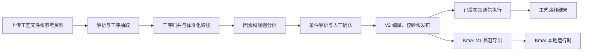
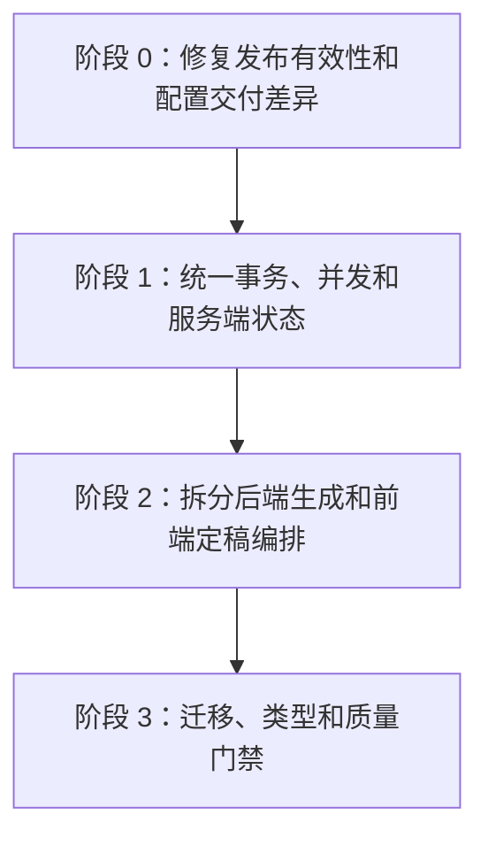

# ProcessMind 重构与优化跟踪

> - 文档状态：执行中
> - 建立日期：2026-08-06
> - 最近更新：2026-08-06
> - 基线提交：`846c673`
> - 适用范围：`process-plan-agent-api/`、`process-plan-agent-ui/`、`docs/`、Docker 与离线交付脚本

## 1. 文档目的

本文是 ProcessMind 重构与优化工作的总跟踪入口，用于统一记录：

1. 当前已经确认的问题和风险。
2. 每项工作的优先级、依赖关系、实施状态和验收标准。
3. 对应的设计文档、实施计划、代码变更和验证结果。
4. 已完成工作的结论及仍然保留的风险。

本文不是一次性重写计划。每个条目应独立设计、独立实施、独立验证，避免在同一变更中同时改动发布协议、数据库结构、业务规则和页面交互。

## 2. 维护约定

### 2.1 状态定义

| 状态 | 含义 |
| --- | --- |
| 未开始 | 已确认问题和目标，尚未进入设计 |
| 设计中 | 正在明确边界、方案、兼容要求和验收标准 |
| 待实施 | 设计已确认，实施计划已完成 |
| 进行中 | 正在编码、测试或修订 |
| 阻塞 | 存在明确的外部依赖或待确认决策 |
| 已完成 | 验收标准全部满足，验证结果已记录 |
| 暂缓 | 当前收益不足以覆盖风险或实施成本 |

### 2.2 更新规则

1. 开始一个条目前，先把状态改为“设计中”。
2. 涉及行为、协议、状态语义或跨模块边界的条目，应先在 `docs/superpowers/specs/` 创建独立设计文档。
3. 设计确认后，在 `docs/superpowers/plans/` 创建独立实施计划，再把状态改为“待实施”。
4. 实施时只修改当前条目直接涉及的文件，不顺带处理其他条目。
5. 每个条目必须先增加或更新行为测试，再修改实现。
6. 完成时必须填写实际执行的验证命令、结果、提交或变更引用，并更新本文末尾的变更记录。
7. 未经明确授权，不自动执行 Git 提交、推送、变基或分支删除。

## 3. 当前架构基线



### 3.1 主要数据所有权

| 数据 | 权威来源 | 说明 |
| --- | --- | --- |
| 原始文档与参考资料 | `data/uploads/` 与数据库记录 | 文件变化必须使下游派生结果失效 |
| 抽取工序和归并快照 | SQLite | 第二步结果，可被上游资料变化重建 |
| 标准化路线版本 | SQLite | 第三、四、五步的共同来源 |
| 因素和条件审核 | SQLite | 用户确认结果必须由后端维护 |
| 已发布 V2 规则包 | `finalized_rule_packages` | 不可变快照；只有有效的 `published` 包可以执行 |
| KmAI V1 文件 | 发布 ZIP 中的 `kmai-v1/` | 由 V2 包确定性转换，不能在前端单独拼装 |
| 页面草稿和短期缓存 | 浏览器本地状态 | 只能改善交互，不能决定服务端业务有效性 |

### 3.2 已有稳定基础

以下能力已有明确边界和较强测试，后续重构不得回退：

1. V2 规则包使用严格 Pydantic 契约，未知字段默认拒绝。
2. 规则编译、校验、模拟、发布、归档和执行已有独立服务模块。
3. KmAI 导出已经分成上下文、因素、条件和路线构建模块。
4. 条件解析已经分成本地解析、LLM 边界、语义校验、状态、仓储和服务模块。
5. 发布包具有版本、内容哈希和单项目唯一 `published` 约束。
6. 工作流重置具有 `workflow_revision` 乐观并发保护。
7. 离线交付脚本会过滤运行时数据、配置密钥和构建噪声。

### 3.3 初始验证基线

2026-08-05/06 审查时的结果：

| 验证项 | 命令 | 结果 |
| --- | --- | --- |
| 后端全量测试 | `..\.runtime\python\python.exe -m pytest tests -q` | `288 passed, 1 skipped, 1 warning` |
| 前端全量测试 | `npm.cmd test` | `25` 个测试文件、`123 passed` |
| 前端生产构建 | `npm.cmd run build` | 成功，转换 `1826` 个模块 |

现有警告：FastAPI/Starlette 测试客户端存在 httpx 迁移弃用提示，不影响当前测试结果，列入 R-010 处理。

## 4. 总体路线

推荐采用“正确性优先、边界收敛、最后工程化”的渐进方案。



不采用以下方案：

1. **一次性重写**：影响 V2/V1/KmAI 协议、历史数据和前端工作流，回归面过大。
2. **只按文件行数拆分**：无法解决发布有效性、事务所有权和跨环境配置差异。
3. **只在出现功能需求时顺手重构**：高风险问题会长期缺少统一验收和完成定义。

## 5. 跟踪总表

| ID | 优先级 | 条目 | 状态 | 依赖 | 阶段 |
| --- | --- | --- | --- | --- | --- |
| R-001 | P0 | 条件修改后发布包的服务端失效与执行校验 | 已完成 | 无 | 阶段 0 |
| R-002 | P0 | 参数问答策略的单一来源与 Docker 一致性 | 已完成 | 无 | 阶段 0 |
| R-003 | P1 | 派生路线写操作的事务和工作流版本统一 | 未开始 | R-001 | 阶段 1 |
| R-004 | P1 | `generate.py` 应用服务拆分 | 未开始 | R-003 | 阶段 2 |
| R-005 | P1 | `FinalizeView.vue` 状态与副作用拆分 | 未开始 | R-001、R-006 | 阶段 2 |
| R-006 | P1 | 服务端发布状态与过期原因接口 | 未开始 | R-001 | 阶段 1 |
| R-007 | P2 | 启动时数据库维护改为版本化迁移 | 未开始 | R-003 | 阶段 3 |
| R-008 | P2 | 明确 SQLite 支持边界 | 未开始 | R-007 | 阶段 3 |
| R-009 | P2 | 工作流状态和前后端 API 类型收敛 | 未开始 | R-003、R-006 | 阶段 3 |
| R-010 | P2 | CI、静态检查、覆盖率和交付冒烟测试 | 未开始 | R-001、R-002 | 阶段 3 |

## 6. 条目明细

### R-001 条件修改后发布包的服务端失效与执行校验

- **优先级：** P0
- **状态：** 已完成
- **问题类型：** 生产正确性、数据一致性

#### 当前进展

- 2026-08-06：确认条件草稿和解析状态转换会清除原有确认结果，但四个条件审核写接口没有同步归档当前发布包。
- 2026-08-06：确认第五步执行入口只加载 `status=published` 的规则包并校验客户端指纹，尚未校验包内用户规则是否仍与数据库中的当前确认结果一致。
- 2026-08-06：现有 `require_confirmed_user_rule_sources()` 已能比较包内用户规则与服务端确认记录，可作为执行期防御校验复用。
- 2026-08-06：方案已确认，设计文档见 `docs/superpowers/specs/2026-08-06-r001-published-rule-package-invalidation-design.md`。
- 2026-08-06：书面设计已审阅确认，实施计划见 `docs/superpowers/plans/2026-08-06-r001-published-rule-package-invalidation.md`。
- 2026-08-06：已实现条件写入事务化归档和 V2 执行期来源漂移防御，完成后端全量、前端错误契约与生产构建验证。

#### 实施前问题

条件草稿、解析、确认和人工设定会更新 `normalized_route_segment_rule_reviews`，但当前发布包不会在服务端同步归档。前端会在当前页面中把包标记为过期，并在重新加载时重新编译比较哈希，但这不是服务端有效性约束。

直接 API 调用、另一个浏览器标签或重新进入生成页时，后端仍可能加载 `status=published` 的旧包。请求中的规则包 ID、版本和哈希只能证明客户端与旧发布包一致，不能证明旧包仍与当前已确认规则一致。

#### 目标行为

1. 服务端是“发布包是否仍有效”的唯一事实来源。
2. 会改变规则语义的审核写操作必须使当前发布包失效，或增加可被执行入口校验的源规则版本。
3. 生成入口不得执行与当前确认来源不一致的规则包。
4. 前端仅展示服务端状态，不自行承担有效性判断。

#### 实际修改文件

- `process-plan-agent-api/app/services/rule_packages/condition_review_service.py`
- `process-plan-agent-api/app/services/rule_packages/lifecycle.py`
- `process-plan-agent-api/app/services/rule_packages/execution.py`
- `process-plan-agent-api/app/routers/generate.py`
- `process-plan-agent-api/tests/test_condition_review_service.py`
- `process-plan-agent-api/tests/test_generate_v2_production.py`
- `process-plan-agent-api/tests/test_rule_condition_parser.py`
- `process-plan-agent-api/tests/test_rule_package_lifecycle.py`
- `docs/重构与优化跟踪.md`
- `docs/superpowers/specs/2026-08-06-r001-published-rule-package-invalidation-design.md`
- `docs/superpowers/plans/2026-08-06-r001-published-rule-package-invalidation.md`

#### 验收标准

- [x] 发布 V2 包后修改条件草稿，原包不能继续用于生成。
- [x] 发布 V2 包后重新解析、确认或人工设定条件，原包状态在服务端变为不可执行。
- [x] 携带旧包正确指纹的生成请求仍返回结构化 `409`，不得创建 `GeneratedRoute`。
- [x] 只修改与规则语义无关的展示状态时，不应无条件归档发布包。
- [x] 新旧浏览器标签观察到相同的服务端发布状态。
- [x] V1 历史包行为和 KmAI ZIP 内容不发生未约定变化。

#### 验证结果

| 验证项 | 命令 | 结果 |
| --- | --- | --- |
| 聚焦后端回归 | `..\.runtime\python\python.exe -m pytest tests/test_rule_package_lifecycle.py tests/test_condition_review_state.py tests/test_condition_review_repository.py tests/test_condition_review_service.py tests/test_rule_condition_parser.py tests/test_rule_package_api.py tests/test_generate_v2_production.py tests/test_workflow_invalidation.py tests/test_rule_package_archive.py tests/test_kmai_rule_package_export.py tests/test_kmai_export_routes.py tests/test_kmai_export_factors.py tests/test_kmai_export_context.py tests/test_kmai_export_conditions.py tests/test_kmai_compatibility_runner.py -q` | `174 passed, 1 warning` |
| 后端全量测试 | `..\.runtime\python\python.exe -m pytest tests -q` | `294 passed, 1 skipped, 1 warning` |
| 前端错误契约 | `npm.cmd test -- src/utils/generateRulePackageContext.spec.ts` | `1` 个测试文件、`4 passed` |
| 前端生产构建 | `npm.cmd run build` | 成功，转换 `1826` 个模块 |

现有唯一测试警告仍为 TestClient/httpx 弃用提示，归入 R-010。验证时发现原计划中的 `tests/test_kmai_export.py` 已拆分为多个 `test_kmai_*` 文件，聚焦命令已按实际文件修正。当前变更未执行 Git 提交、暂存或推送。

#### 剩余范围

- `segment-rule-reviews` 相关写入的事务归属和统一失效仍由 R-003 处理。
- 服务端发布状态聚合与过期原因只读接口仍由 R-006 处理。

#### 主要风险

归档时机过宽会导致用户频繁重新发布；归档时机过窄会留下旧包执行路径。设计阶段必须明确哪些状态转换改变规则语义。

### R-002 参数问答策略的单一来源与 Docker 一致性

- **优先级：** P0
- **状态：** 已完成
- **问题类型：** 部署一致性、配置所有权

#### 实施前问题

后端 `param_question_strategy.py` 直接读取前端源码目录中的 `src/config/paramQuestionStrategy.json`。本地开发和离线完整包包含该文件，但 API Docker 镜像没有复制前端源码；文件缺失时后端静默使用另一套硬编码回退策略，导致本地与 Docker 的问答分类和排序可能不同。

#### 实施方案

将策略文件移动到共享交付目录：

`docs/配置模板/第五步参数问答策略.json`

后端通过 `app.core.paths` 读取，前端通过构建时原始资源导入。Docker API、Docker Web 和离线交付均显式复制同一文件。配置增加稳定版本号或内容哈希。

#### 当前进展

- 2026-08-06：完成方案设计，设计文档见 `docs/superpowers/specs/2026-08-06-r002-param-question-strategy-delivery-design.md`，实施计划见 `docs/superpowers/plans/2026-08-06-r002-param-question-strategy-delivery.md`。
- 2026-08-06：将策略迁移至 `docs/配置模板/第五步参数问答策略.json`，增加 `version: "1.0.0"`；前后端均改为读取共享文件，删除旧前端 JSON 路径。
- 2026-08-06：后端加载器通过 `app.core.paths` 统一路径，支持显式测试路径注入，对缺失、非法 JSON 和非法结构抛出明确错误；API lifespan 在数据库初始化前强制校验。
- 2026-08-06：Docker API、Docker Web 显式复制共享策略；离线 staging 测试确认 `docs/配置模板/第五步参数问答策略.json` 会进入交付包。

#### 实际修改文件

- `docs/配置模板/第五步参数问答策略.json`
- `process-plan-agent-api/app/core/paths.py`
- `process-plan-agent-api/app/services/param_question_strategy.py`
- `process-plan-agent-api/app/main.py`
- `process-plan-agent-api/tests/test_param_question_strategy.py`
- `process-plan-agent-api/tests/test_delivery_config.py`
- `process-plan-agent-api/tests/test_offline_package_safety.py`
- `process-plan-agent-ui/src/config/paramQuestionStrategy.ts`
- `Dockerfile.api`
- `Dockerfile.web`
- 删除 `process-plan-agent-ui/src/config/paramQuestionStrategy.json`

#### 涉及文件

- `docs/配置模板/第五步参数问答策略.json`
- `process-plan-agent-api/app/core/paths.py`
- `process-plan-agent-api/app/services/param_question_strategy.py`
- `process-plan-agent-ui/src/config/paramQuestionStrategy.ts`
- `Dockerfile.api`
- `Dockerfile.web`
- `process-plan-agent-api/tests/test_delivery_config.py`

#### 验收标准

- [x] 本地后端、Docker API 和离线包读取同一策略内容及版本。
- [x] 前端和后端对代表性工序名称得到相同的工序族和优先级顺序。
- [x] 正式运行环境中配置缺失或 JSON 无效时启动失败并给出明确错误。
- [x] 测试环境可以显式注入测试配置，不依赖前端源码目录。
- [x] 删除旧文件后不存在隐式兼容读取路径。

#### 验证结果

| 验证项 | 命令 | 结果 |
| --- | --- | --- |
| 策略与交付聚焦测试 | `..\.runtime\python\python.exe -m pytest tests/test_param_question_strategy.py tests/test_delivery_config.py -q` | `10 passed` |
| 离线交付安全测试 | `..\.runtime\python\python.exe -m pytest tests/test_delivery_config.py tests/test_offline_package_safety.py -q` | `12 passed, 1 skipped` |
| 后端全量测试 | `..\.runtime\python\python.exe -m pytest tests -q` | `301 passed, 1 skipped, 1 warning` |
| 前端全量测试 | `npm.cmd test` | `25` 个测试文件、`123 passed` |
| 前端生产构建 | `npm.cmd run build` | 成功，转换 `1826` 个模块 |
| Docker 镜像构建 | `docker compose build api web` | 未执行；本机未安装 Docker CLI |

现有唯一测试警告仍为 TestClient/httpx 弃用提示，归入 R-010。Dockerfile 的源码级 COPY 断言和离线 staging 已通过，实际镜像构建需在具备 Docker 的环境补验。

### R-003 派生路线写操作的事务和工作流版本统一

- **优先级：** P1
- **状态：** 未开始
- **问题类型：** 并发、事务所有权、服务边界

#### 当前问题

条件审核和发布接口已经由路由拥有锁、提交和回滚，但标准化路线保存、归并建议审核及部分路线分析服务仍存在内部 `commit()`，且并非所有写请求都携带 `expected_workflow_revision`。这会增加多标签页覆盖、部分提交和服务复用时的风险。

#### 目标边界

```text
HTTP 路由/命令处理器
  -> 校验工作流版本并取得写锁
  -> 调用应用服务
  -> 一次性 commit 或 rollback

应用服务/仓储
  -> 查询、业务校验、add/delete/flush
  -> 不完成外层事务
```

不引入通用 Unit of Work 框架，继续使用当前 FastAPI + SQLAlchemy async 模式。

#### 预计涉及文件

- `process-plan-agent-api/app/routers/extract.py`
- `process-plan-agent-api/app/services/route_analysis.py`
- `process-plan-agent-api/app/services/route_merge/workspace.py`
- `process-plan-agent-api/app/services/project_workflow_lifecycle.py`
- `process-plan-agent-api/app/schemas/schemas.py`
- `process-plan-agent-api/tests/test_workflow_invalidation.py`
- `process-plan-agent-api/tests/test_normalized_route_version_dedup.py`

#### 验收标准

- [ ] 所有改变标准化路线、归并审核和下游规则的接口都校验工作流版本。
- [ ] 服务层不提交或回滚外层事务。
- [ ] 旧页面写入返回结构化 `409`，且不产生部分更新。
- [ ] 同一请求中的路线、审核、发布包失效和版本变化在一个事务内完成。
- [ ] 正常单用户流程和现有响应结构保持兼容。

### R-004 `generate.py` 应用服务拆分

- **优先级：** P1
- **状态：** 未开始
- **问题类型：** 后端可维护性、测试隔离

#### 当前问题

`app/routers/generate.py` 同时承担 HTTP、样本统计、问答生成、LLM 增强、审核汇总、V1/V2 执行选择、结果组装和数据库写入。路由只有两个公开接口，但内部包含大量业务函数和跨服务依赖。

#### 推荐边界

| 单元 | 责任 |
| --- | --- |
| `param_audit_service.py` | 样本统计、审核问题和审核概览构建 |
| `route_generation_service.py` | 选择 V1/V2 执行路径并返回领域结果 |
| `generate_route_result_builder.py` | 把领域结果转换为 API 输出和持久化 JSON |
| `routers/generate.py` | 请求校验、工作流锁、异常映射、持久化和事务 |

现有已拆出的 `rule_packages.execution`、`param_question_*` 和 `generate_*` 模块应继续复用，不建立第二套规则执行逻辑。

#### 验收标准

- [ ] `generate.py` 不再包含参数审核算法和 LLM 问题增强实现。
- [ ] V1、V2、空结果和输入无效行为由直接服务测试覆盖。
- [ ] HTTP 错误状态与响应 detail 形状保持不变。
- [ ] V2 无可执行路线时仍禁止静默退回旧抽取结果。
- [ ] 生成记录只在规划成功后写入。

### R-005 `FinalizeView.vue` 状态与副作用拆分

- **优先级：** P1
- **状态：** 未开始
- **问题类型：** 前端可维护性、异步状态管理

#### 当前问题

`FinalizeView.vue` 同时维护工作区加载、规则卡片派生状态、条件识别队列、批量确认、本地草稿、发布审核、下载、过期判断和工作流冲突处理。虽然已有多个 composable，但页面仍是主要状态协调器。

#### 推荐边界

| 单元 | 责任 |
| --- | --- |
| `useFinalizeWorkspace` | 项目、路线、工序和标准因子目录加载 |
| `useConditionReviewQueue` | 单条/批量解析、确认、取消和并发保护 |
| `useRulePackagePublication` | 服务端发布状态、发布审核和下载 |
| `useFinalizeWorkflowConflict` | 工作流版本冲突、重载和重置响应 |
| `FinalizeView.vue` | 页面布局、组合子模块和导航 |

本轮不默认引入 Pinia。优先沿用现有 feature-scoped composable，除非后续确认多个路由需要共享长期状态。

#### 验收标准

- [ ] 页面不直接实现条件解析队列和发布有效性算法。
- [ ] 路由切换、项目切换和后台任务取消行为保持一致。
- [ ] 本地草稿、工作流重置和服务端已确认规则不会互相覆盖。
- [ ] 关键 composable 具有独立 Vitest 覆盖。
- [ ] 桌面和移动端既有布局及交互不回退。

### R-006 服务端发布状态与过期原因接口

- **优先级：** P1
- **状态：** 未开始
- **问题类型：** 单一事实来源、前后端契约

#### 目标

增加服务端只读状态接口，统一返回：

- 当前发布包 ID、版本、schema 版本和内容哈希。
- 当前路线版本和工作流版本。
- 发布包是否可执行。
- 过期或阻塞原因的稳定代码列表。
- 待确认规则、无效因素绑定和 KmAI 兼容性阻塞摘要。

具体 URL 和响应模型在独立设计中确定。前端不得通过重新编译整个草稿来推断发布包是否过期。

#### 验收标准

- [ ] 同一项目在定稿页、生成页和直接 API 调用中得到一致状态。
- [ ] 状态接口无写入副作用。
- [ ] 前端按稳定错误代码展示，不依赖中文消息匹配。
- [ ] 状态计算复用发布和执行服务，不复制校验算法。

### R-007 启动时数据库维护改为版本化迁移

- **优先级：** P2
- **状态：** 未开始
- **问题类型：** 数据演进、启动可靠性

#### 推荐方案

第一阶段复用现有 `schema_migrations` 表，不立即增加 Alembic：

1. 把建表、增列、一次性回填和数据修复拆成有序迁移函数。
2. 每个迁移只执行一次，并记录版本、时间和结果。
3. 启动时只执行尚未应用的迁移。
4. 重型审计和修复改为显式维护命令，不在每次启动执行。

只有在明确需要支持多数据库或复杂回滚后，再评估 Alembic。

#### 验收标准

- [ ] 全新数据库和至少一个历史数据库快照都能升级到当前 schema。
- [ ] 同一迁移重复启动不会再次修改数据。
- [ ] 迁移失败时事务回滚并给出迁移名称。
- [ ] 启动路径不再执行已经完成的一次性回填。
- [ ] 离线升级流程有可操作的备份和失败恢复说明。

### R-008 明确 SQLite 支持边界

- **优先级：** P2
- **状态：** 未开始
- **问题类型：** 配置真实性、部署边界

#### 推荐决策

近期明确声明仅支持 SQLite。启动时验证 `DATABASE_URL`，对非 SQLite URL 给出明确错误。原因是当前 schema 维护依赖 `PRAGMA`、`sqlite_master`、SQLite 自增和部分索引语法。

如果未来需要 PostgreSQL，应单独建立数据库迁移和兼容性项目，不在当前重构中顺带实现。

#### 验收标准

- [ ] README、环境模板和启动错误都明确当前数据库支持范围。
- [ ] 非 SQLite URL 不会进入运行后才因 DDL 失败。
- [ ] Docker、Windows 和 macOS 默认数据库路径行为一致。
- [ ] `PROCESSMIND_DATA_DIR` 与遗留数据库自动发现的优先级有明确测试。

### R-009 工作流状态和前后端 API 类型收敛

- **优先级：** P2
- **状态：** 未开始
- **问题类型：** 契约一致性、状态语义

#### 推荐方案

1. 后端使用应用级 `StrEnum` 或集中常量表达项目、任务、审核和发布状态，数据库继续保留 `VARCHAR` 以避免无必要迁移。
2. 状态变化通过明确的转换函数完成，不在路由和组件中散落字符串赋值。
3. 从 FastAPI OpenAPI 生成或校验前端 DTO，逐步替换 `api/extract.ts`、`api/rulePackages.ts` 中的手写重复类型。
4. 服务端响应提供 `can_publish`、`can_generate` 等能力字段时，前端不重复推导业务条件。

#### 验收标准

- [ ] 非法状态转换在后端被拒绝并有单元测试。
- [ ] 前端构建能检测主要 API 字段漂移。
- [ ] V2 和 KmAI 协议类型不因 UI 展示需求增加无关字段语义。
- [ ] 历史数据库状态值仍能正常读取和规范化。

### R-010 CI、静态检查、覆盖率和交付冒烟测试

- **优先级：** P2
- **状态：** 未开始
- **问题类型：** 工程质量、交付可靠性

#### 建议门禁

| 类型 | 最低要求 |
| --- | --- |
| 后端 | Python 3.11 与 3.13 全量 pytest；Ruff；关键模块覆盖率报告 |
| 前端 | Node 20；Vitest；`vue-tsc`；Vite build |
| Docker | API/Web 镜像构建；健康检查；共享配置版本一致 |
| Windows 离线包 | 安全扫描测试；允许清单测试；启动脚本冒烟 |
| 端到端 | 上传到发布再生成的主链路；修改规则后旧包拒绝执行 |

首轮不以追求全仓库高覆盖率为目标。优先为发布、执行、工作流失效、迁移和交付配置设置覆盖率门禁。

#### 验收标准

- [ ] 新提交在合并前自动执行后端、前端和构建验证。
- [ ] Docker API 实际包含运行所需的全部共享配置。
- [ ] Starlette/httpx 测试客户端弃用警告有明确升级结论。
- [ ] CI 不读取或上传真实 `data/`、`.env`、上传文件和本地设置。

## 7. 条目实施流程

每个条目按以下顺序推进：

```text
更新本文状态为“设计中”
  -> 建立独立设计文档
  -> 明确兼容边界和非目标
  -> 设计评审
  -> 建立独立实施计划
  -> 先写失败测试
  -> 最小实现
  -> 聚焦验证
  -> 全量回归
  -> 更新本文状态和验证证据
```

设计文档建议命名：

`docs/superpowers/specs/YYYY-MM-DD-rNNN-主题-design.md`

实施计划建议命名：

`docs/superpowers/plans/YYYY-MM-DD-rNNN-主题.md`

其中 `rNNN` 对应本文条目编号，例如 `r001`。

## 8. 通用验证命令

### 8.1 后端

在 `process-plan-agent-api/` 执行：

```powershell
..\.runtime\python\python.exe -m pytest tests -q
```

### 8.2 前端

在 `process-plan-agent-ui/` 执行：

```powershell
npm.cmd test
npm.cmd run build
```

### 8.3 交付配置

在仓库根目录执行：

```powershell
.\.runtime\python\python.exe -m pytest process-plan-agent-api\tests\test_delivery_config.py process-plan-agent-api\tests\test_offline_package_safety.py -q
```

Docker 可用时执行：

```powershell
docker compose build api web
```

### 8.4 差异检查

```powershell
git diff --check
git status --short
```

## 9. 完成定义

单个条目只有同时满足以下条件才能标记为“已完成”：

1. 条目验收标准全部勾选。
2. 行为变化具有自动化测试。
3. 聚焦测试和全量回归均通过。
4. API、数据、V2/KmAI 协议和离线交付影响已明确记录。
5. 设计文档、实施计划和 README 等相关说明已同步。
6. 剩余风险和未验证事项已经写入条目或变更记录。

整个优化计划完成时还必须满足：

1. 条件修改后不存在继续执行旧发布包的路径。
2. 本地、Docker 和离线包使用相同的领域配置。
3. 关键写操作具有统一事务和工作流版本保护。
4. 后端路由与前端页面不再承担核心规则计算和发布有效性判断。
5. 数据迁移和交付流程具有自动化质量门禁。

## 10. 变更记录

| 日期 | 条目 | 变更 | 验证或证据 |
| --- | --- | --- | --- |
| 2026-08-06 | 总体 | 建立重构与优化总跟踪文档，记录 R-001 至 R-010 | 后端 `288 passed, 1 skipped`；前端 `123 passed`；生产构建成功 |
| 2026-08-06 | R-001 | 条件来源实际变化后归档当前发布包；执行入口拒绝并归档来源漂移的 V2 包 | 聚焦后端 `174 passed`；后端全量 `294 passed, 1 skipped`；前端契约 `4 passed`；生产构建成功 |
| 2026-08-06 | R-002 | 参数问答策略迁移到共享交付目录；后端严格校验并在启动前失败；前端、Docker、离线包统一读取 | 后端全量 `301 passed, 1 skipped`；前端 `123 passed`；生产构建成功；离线测试 `12 passed, 1 skipped`；Docker CLI 未安装 |
