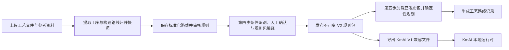
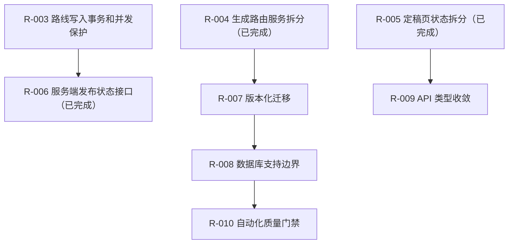

# ProcessMind 重构与优化跟踪

> **文档状态：** 当前代码基线已复核，R-003、R-004、R-005、R-006、R-007、R-008、R-009 已验证完成
>
> **复核日期：** 2026-08-10
>
> **代码基线：** `66c8e4d`（版本化数据库迁移）加当前工作区的 R-005、R-006、R-007、R-008、R-009 实现
>
> **适用范围：** `process-plan-agent-api/`、`process-plan-agent-ui/`、`docs/`、Docker 和 Windows 离线交付脚本
>
> **复核方法：** 当前源码静态分析、后端全量 pytest、前端全量 Vitest、前端类型检查和生产构建

## 1. 文档目的与使用规则

本文记录当前工作区已经由代码和自动化验证支持的结论，以及后续重构的最小推进顺序。它不替代各条目的设计文档和实施计划，也不把设计稿视作已完成实现。

维护时遵循以下规则：

1. 只根据当前代码、已提交变更和实际测试输出更新状态。
2. 已完成条目必须同时具备实现证据和自动化验证；只有设计或计划时使用“待实施”。
3. 涉及 V2 规则包、KmAI V1 导出、数据库状态或工作流并发的修改，必须先明确协议和事务边界。
4. 未执行的 Docker、Python 3.11、离线包或端到端验证必须明确写为“未验证”，不能由静态阅读替代。
5. 不在本文中记录真实数据库、上传文件、`.env`、密钥或运行时输出。

R-003 与 R-004 的实施计划已随本次实现复核并保持一致；其余未跟踪文档不代表已编码或已验收。

### 1.1 状态定义

| 状态 | 含义 |
| --- | --- |
| 已验证完成 | 当前实现存在，验收行为已由本次或保留的自动化测试覆盖 |
| 部分完成 | 已拆出一部分边界或能力，但目标行为尚未完全收敛 |
| 待实施 | 方案和文件范围已明确，尚未开始对应代码变更 |
| 待设计 | 问题已确认，但 API、数据或兼容边界尚未定稿 |
| 未建立 | 尚无可执行方案或基础设施 |
| 未验证 | 代码或配置存在，但本次环境未能实际运行该验证 |

## 2. 当前架构基线

### 2.1 已验证的稳定基础

| 范围 | 当前实现与证据 |
| --- | --- |
| V2 契约和规则处理 | `rule_packages/contracts.py` 的 `StrictModel` 使用 `extra="forbid"`；编译、校验、模拟和兼容性测试分别由服务和路由承担。 |
| 条件审核边界 | 条件解析、本地/LLM 解析、状态转换、仓储和应用服务已分离；`routers/rule_packages.py` 在条件写路径持有工作流版本锁并负责提交或回滚。 |
| 已发布包有效性 | 条件实际变化会通过 `archive_published_rule_packages()` 归档当前包；V2 执行前再次比较已确认来源，发现漂移会归档并返回结构化 `409`。 |
| 发布与执行服务 | 发布准备和 V2 执行分别位于 `rule_packages/publishing.py`、`rule_packages/execution.py`；参数审核聚合和 V1/V2 生成选择分别位于 `param_audit.py`、`route_generation.py`，路由保留 HTTP 映射、事务和结果持久化。 |
| 参数问答策略交付 | `docs/配置模板/第五步参数问答策略.json` 是共享版本化来源；后端启动前严格校验，前端构建时导入，Dockerfile 和离线 staging 测试显式覆盖。 |
| KmAI V1 兼容导出 | `kmai_export.py` 已分为上下文、因素、条件和路线模块；固定导出四个 V1 文件，并限制条件组合数量和条件对象数量。 |

### 2.2 重要边界

- ProcessMind 是规则生产端。它通过 ZIP 中的 `kmai-v1/` 文件与 KmAI 交接，不 import KmAI 源码，也不直接调用 3DMPS。
- 兼容导出的固定文件为 `factor_schema.json`、`factor_expansion_rules.json`、`route_catalog.json`、`route_rules.json`；交接时必须保留 KmAI 端已有的 `group_match_rules.json`。
- `manual_override` 因素只能由 KmAI 输入中的 `manual.factor_overrides` 提供，不能从来源字段自动推断。
- `all` / `any` 展开默认限制为 `10000` 个组合和 `100000` 个条件对象，配置名为 `PROCESSMIND_KMAI_MAX_COMBINATIONS` 与 `PROCESSMIND_KMAI_MAX_CONDITION_OBJECTS`。

## 3. 本次验证基线

| 验证项 | 实际命令 | 结果 |
| --- | --- | --- |
| 后端全量与规则包覆盖率 | 在 `process-plan-agent-api/` 使用仓库自带 Python 3.13.5 执行 `..\\.runtime\\python\\python.exe -W default -m pytest -q --cov=app.services.rule_packages --cov-report=term --cov-report=xml` | `388 passed, 1 skipped`，规则包覆盖率 `86.54%`，超过 `85%` 门槛，无警告，耗时 `37.18s` |
| 后端静态与语法检查 | 执行 `python -m ruff check app tests ..\\scripts` 和 `python -m compileall -q app tests ..\\scripts` | 均通过；Ruff 使用 `E9,F63,F7,F82` 高置信度基线 |
| 交付冒烟 | 执行 `python -W default -m pytest -q -m delivery_smoke` | `3 passed, 386 deselected`；覆盖上传到发布再生成、已发布 V2 生成和来源漂移归档/稳定 `409` |
| 前端全量测试 | 在 `process-plan-agent-ui/` 执行 `npm.cmd test` | `30` 个测试文件、`144 passed` |
| 前端类型检查与生产构建 | 在 `process-plan-agent-ui/` 执行 `npm.cmd run build` | 成功，`vue-tsc -b` 通过，Vite 转换 `1830` 个模块 |
| OpenAPI 契约门禁 | 在 `process-plan-agent-ui/` 执行 `npm.cmd run check:api-contract` | 通过；状态类型文件与 FastAPI OpenAPI 一致 |
| Windows 离线安全与本地打包 | 执行离线安全/交付配置测试及 `pack-offline-windows.ps1 -SkipNodePrepare` | `12 passed, 1 skipped`；生成约 `90.2 MB` ZIP，共 `16047` 个条目，禁用环境文件、上传数据、数据库和运行时设置均为 `0`，临时目录已删除 |
| GitHub Actions 结构 | 使用 PyYAML 解析 `.github/workflows/quality-gates.yml` 并核对 job 集合 | 通过；准确包含 6 个 job，未配置 `continue-on-error` |

### 3.1 已知验证限制

1. 本次使用仓库自带 Python `3.13.5` 完成后端全量、Ruff、覆盖率和交付冒烟；GitHub Actions 已配置 Python `3.11` / `3.13` 矩阵，但 Python 3.11 job 尚未实际运行。
2. 本机未发现 `docker` CLI，未执行 `docker compose build api web`、容器健康检查或镜像内共享策略文件检查。
3. `.github/workflows/quality-gates.yml` 已通过本地 YAML 结构检查，但尚未推送或由 GitHub Actions runner 实际执行，不能视为 CI 已通过。
4. TestClient 已通过测试专用依赖 `httpx2` 消除迁移弃用警告；生产业务仍使用 `httpx`。数据库维护脚本和 pytest 临时目录的连接/资源清理也已修复，全量输出无警告。
5. Windows 离线包已在本机验证 staging、安全扫描和 `-SkipNodePrepare` 压缩内容；完整 bundled Node、解压后启动、8000/5173 健康检查及干净 Windows runner 仍待实测。

## 4. 跟踪总表

| ID | 优先级 | 状态 | 当前结论 | 下一道验收门 |
| --- | --- | --- | --- | --- |
| R-001 | P0 | 已验证完成 | 条件变化和执行期来源漂移都会使已发布 V2 包不可执行 | 保持回归覆盖，不扩展为前端自行判定 |
| R-002 | P0 | 已验证完成，Docker 未验证 | 参数问答策略已有单一交付来源和启动期校验 | 在有 Docker 的环境实际构建 API/Web 镜像 |
| R-003 | P1 | 已验证完成 | 路线归并、标准化路线保存和规则审核由路由统一持锁、提交与回滚，旧页面稳定返回结构化 `409` | 保持原子性与版本冲突回归覆盖 |
| R-004 | P1 | 已验证完成 | 参数审核聚合及 V1/V2 路线生成已移至应用服务；`generate.py` 只保留锁、HTTP 映射和生成记录持久化 | 保持 V1/V2、无有效包 `409` 和工作流失效回归覆盖 |
| R-005 | P1 | 已验证完成 | 工作区、条件审核队列和工作流冲突已拆为 feature-scoped composable；页面只保留展示派生与流程接线 | 保持请求过期、批量审核、409 重载和重置回归覆盖 |
| R-006 | P1 | 已验证完成 | 服务端统一返回发布、执行、审核、来源和 KmAI 阻塞状态；第四、第五步均消费该事实来源 | 保持只读状态与执行期写入边界回归覆盖 |
| R-007 | P2 | 已验证完成 | 启动只执行未应用的 1 至 5 版本迁移；重复工序审计、预览和修复已移至带 SQLite 备份的显式命令 | 保持迁移历史追加约束，并在 R-010 纳入自动化质量门禁 |
| R-008 | P2 | 已验证完成，Docker 未验证 | 启动前只接受 `sqlite+aiosqlite`；非 SQLite、同步 SQLite 驱动和非法 URL 均返回不泄露凭据的明确错误 | 保持 SQLite 边界回归；多数据库支持另立兼容性与迁移项目 |
| R-009 | P2 | 已验证完成 | 后端状态枚举进入响应/OpenAPI；前端工作流、发布和 V2 API DTO 复用生成状态契约，API 层不再使用 `Record<string, any>` | 保持生成文件与 OpenAPI 同步；更广泛的页面内部类型清理另行推进 |
| R-010 | P2 | 已建立，本地已验证，CI/Docker 待实测 | 已建立六 job 工作流、Python 3.11/3.13 矩阵、Ruff、85% 规则包覆盖率、前端、Docker、Windows 离线和三场景交付冒烟门禁 | 在 GitHub 实跑全部 job，并补齐 Docker 与干净 Windows 离线启动证据 |

## 5. 条目明细

### R-001 条件变化后发布包的服务端失效与执行校验

- **优先级：** P0
- **状态：** 已验证完成
- **相关提交：** `3dc6203`、`198eea2`、`b126bcb`

#### 已完成范围

1. `condition_review_service.py` 在条件草稿、解析开始、确认和人工设定产生实际语义变化后调用 `archive_published_rule_packages()`；无变化的写入不会无条件归档。
2. `execution.py` 在加载已发布 V2 包后调用 `require_confirmed_user_rule_sources()`；确认来源漂移时归档当前包并抛出领域异常。
3. `generate.py` 捕获该异常后只提交归档状态，并以稳定错误码 `published_rule_package_changed` 返回 `409`；不创建生成记录。
4. `process_identity.py` 统一路线段内部 ID 与稳定导出工序 ID 的映射，阻止不唯一工序引用进入发布或审核链路。
5. `condition_review_repository.py` 将 SQLite 回读的时间戳统一序列化为 UTC，避免时区偏移导致规则包内容判断误差。

#### 验收证据

- 条件审核、发布生命周期、执行期防御和工作流失效均有对应 pytest，主要位于 `test_condition_review_service.py`、`test_condition_review_repository.py`、`test_rule_package_lifecycle.py`、`test_generate_v2_production.py`、`test_workflow_invalidation.py`。
- 本次后端全量测试通过：`308 passed, 1 skipped, 1 warning`。

#### 保留边界

- 路线归并、标准化路线保存和第三步规则审核的事务统一不属于本条目，由 R-003 处理。
- 页面仍会做发布包新鲜度展示；跨页面、直接 API 调用的统一状态聚合由 R-006 处理。

### R-002 参数问答策略的单一来源与交付一致性

- **优先级：** P0
- **状态：** 已验证完成，Docker 实构建未验证
- **相关提交：** `dae10b1`

#### 已完成范围

1. 策略已迁移至 `docs/配置模板/第五步参数问答策略.json`，当前版本为 `1.0.0`。
2. 后端通过 `app.core.paths.PARAM_QUESTION_STRATEGY_PATH` 读取；`load_param_question_strategy()` 对文件不存在、非法 JSON 和结构不合法提供明确错误。
3. `app.main` 的 lifespan 在创建运行时状态前强制校验策略，避免 API 启动后才静默使用不同回退逻辑。
4. 前端 `src/config/paramQuestionStrategy.ts` 构建时导入同一 JSON；Docker API、Docker Web 和离线 staging 都有显式 COPY/包含断言。

#### 验收证据

- `test_param_question_strategy.py`、`test_delivery_config.py`、`test_offline_package_safety.py` 已纳入本次全量 pytest。
- 本次前端全量 Vitest 和生产构建通过。

#### 保留边界

- Dockerfile 的内容已由测试断言，但镜像拉取、构建、健康检查和容器内实际读取尚未执行，不能标记为 Docker 运行验证通过。

### R-003 派生路线写操作的事务与工作流版本统一

- **优先级：** P1
- **状态：** 已验证完成
- **依赖：** R-001 已完成
- **相关文档：** [设计](superpowers/specs/2026-08-06-r003-route-write-transaction-design.md)、[实施计划](superpowers/plans/2026-08-06-r003-route-write-transaction.md)

#### 已完成范围

1. `SaveNormalizedSupersetRouteRequest` 和 `MergeSuggestionReviewRequest` 已加入 `expected_workflow_revision`；前端保存、单项/批量审核和改名请求均发送当前项目版本。
2. `normalized-superset-route/save`、`segment-rule-reviews` 和 `merge-suggestions/review` 均在任何写入前调用 `acquire_workflow_revision()`，成功路径由路由一次提交，所有异常路径回滚并保留既有 HTTP 语义。
3. `route_analysis.py` 和 `route_merge/workspace.py` 的相关服务只执行查询、ORM 写入、`flush()` 和必要的 `refresh()`；不再终止外层事务。
4. 会重建归并快照或迁移旧审核数据的读取路由显式提交缓存性写入，避免依赖服务层隐式提交。
5. `ExtractView.vue` 从当前项目和工作流重置信号维护版本令牌，并注入路线归并 composable。

#### 验收证据

- 新增回归覆盖调用方回滚、三类旧版本写请求的结构化 `409`、保存失败时快照回滚，以及当前版本规则审核持久化。
- 后端聚焦验证：`27 passed, 1 warning`；后端全量：`313 passed, 1 skipped, 1 warning`。
- 前端 API 回归：`4 passed`；前端全量 Vitest：`25` 个测试文件、`125 passed`；`npm.cmd run build` 成功，`vue-tsc -b` 通过，Vite 转换 `1826` 个模块。
- `route_analysis.py` 与 `route_merge/workspace.py` 的 `commit/rollback` 搜索无匹配，`git diff --check` 通过。

#### 保留边界

- 未改变规则包 JSON、KmAI V1 ZIP、内容哈希、成功响应字段或工作流版本递增规则；全量回归通过。
- Docker、Python 3.11、离线包、静态检查和 CI 仍沿用本次验证限制，未因 R-003 获得额外运行时验证。

#### 完成标准

- [x] 标准化路线保存、归并建议审核、第三步规则审核都携带并校验真实工作流版本。
- [x] 相关服务没有 `commit()` 或 `rollback()` 外层事务。
- [x] 旧页面收到结构化 `409`，且没有新增路线版本、半更新快照或部分审核记录。
- [x] 正常响应、V2 规则包和 KmAI V1 ZIP 语义不变。
- [x] 后端聚焦/全量、前端 Vitest、生产构建均通过。

### R-004 `generate.py` 剩余应用服务拆分

- **优先级：** P1
- **状态：** 已验证完成
- **相关文档：** [实施计划](superpowers/plans/2026-08-07-r004-generate-route-service-split.md)

#### 已完成范围

- 发布准备和 V2 执行已移至 `rule_packages/publishing.py` 与 `rule_packages/execution.py`。
- `param_audit.py` 负责样本统计、参数审核答案读取、待确认问题、LLM 问题增强、稳定/待确认/数据问题状态和审核概览；不依赖 FastAPI，也不提交事务。
- `route_generation.py` 负责输入归一化、当前发布包及指纹读取、V1/V2 选择、V2 规划和旧规则回退，并以类型化结果返回步骤及规则包元数据；不提交或回滚外层事务。
- `routers/generate.py` 只负责工作流版本锁、领域异常到 HTTP 的映射、`GeneratedRoute` 写入、项目状态更新、提交和 `GenerateResponse` 包装。来源漂移时仍由路由提交归档状态后返回结构化 `409`。
- 无有效已发布包仍返回 `409`，不会再回退到第二步提炼结果；强制 V1 引擎、旧客户端未提交指纹和既有 V1/V2 输出字段保持兼容。

#### 验收证据

- 新增 `test_param_audit_service.py` 覆盖稳定、待确认和数据问题分支；新增 `test_route_generation_service.py` 覆盖 V2 领域结果、强制 V1 路径、旧请求字段归一化、无效包版本和已发布包加载。
- 聚焦回归：`py -3.14 -m pytest -q tests/test_param_audit_service.py tests/test_route_generation_service.py tests/test_generate_v2_production.py tests/test_rule_package_execution.py`，结果 `32 passed, 1 warning`；覆盖参数审核服务、路线生成服务、V2 API、路线失效流程及 V1 已发布包成功/损坏分支。
- 后端全量：`323 passed, 1 skipped, 1 warning`。
- `py -3.14 -m compileall -q app/routers/generate.py app/services/param_audit.py app/services/route_generation.py` 通过；`git diff --check` 通过。

#### 保留边界

- 本条目未修改前端、数据库结构、V2 规则包、KmAI V1 ZIP、内容哈希或发布生命周期；因此未重新执行前端 Vitest/构建，也未获得 Docker、Python 3.11、离线包或端到端新增验证。
- 参数审核原有 HTTP 入口不在当前路由集合中；本次只将其遗留聚合逻辑迁入服务并补齐直接回归，未新增 API 或页面行为。

#### 完成标准

- [x] 参数审核聚合位于应用服务，并有稳定、待确认和数据问题分支测试。
- [x] V1/V2 选择和领域结果位于路线生成服务，路由仅保留锁、HTTP 映射和持久化。
- [x] 无有效已发布包仍返回 `409`，且代码注释不再描述已废弃的第二步静默回退。
- [x] V2 输入、发布包指纹、来源漂移归档和强制 V1 路径的现有回归通过。
- [x] 后端聚焦、全量和差异格式检查通过。

### R-005 `FinalizeView.vue` 状态与副作用继续拆分

- **优先级：** P1
- **状态：** 已验证完成

#### 已完成范围

1. `useFinalizeWorkspace` 统一持有项目、路线、工序、规则包、标准字段和因子目录状态，负责并发加载保护、目录独立失败和服务端规则包状态刷新。
2. `useConditionReviewQueue` 统一单条和批量解析、自动确认、人工确认、主线/Bool 转换、忙碌状态、进度提示和并发取消；取消后的旧成功响应或旧 `409` 不再回写或触发当前页面重载。
3. `useFinalizeWorkflowConflict` 统一工作流版本冲突的单飞重载、外部重置信号、第四步重新识别和旧任务清理；重置前先作废在途条件请求，后台识别只接受返回的工作流版本。
4. `FinalizeView.vue` 保留卡片派生、导航、发布/下载接线和页面生命周期；文件由基线的 `2096` 行降为 `1602` 行，其中 `<script setup>` 由 `1035` 行降为 `541` 行。
5. 继续使用 feature-scoped composable，没有引入 Pinia，也没有新增跨路由共享状态。

#### 验收证据

- 新增 `useFinalizeWorkspace.spec.ts`、`useConditionReviewQueue.spec.ts`、`useFinalizeWorkflowConflict.spec.ts`，聚焦验证为 `3` 个测试文件、`12 passed`。
- 前端全量 Vitest：`28` 个测试文件、`137 passed`。
- `npm.cmd run build` 成功，`vue-tsc -b` 通过，Vite 转换 `1829` 个模块。
- `git diff --check` 通过；页面中已无工作区加载、条件队列或工作流冲突的重复内联实现。

#### 保留边界

- 页面保留本地 dirty 状态用于即时交互保护；已发布包新鲜度和执行能力改由 R-006 的服务端状态接口提供，服务端发布失效和执行拦截仍由 R-001 的后端逻辑负责。
- 本条目没有修改后端 API、数据库、V2 规则包、KmAI V1 ZIP、内容哈希算法或发布生命周期，因此未重复执行后端、Docker、Python 3.11 和离线包验证。
- R-006 已补齐服务端统一发布状态与稳定阻塞原因接口，R-005 的前端拆分没有替代该服务端事实来源。

#### 完成标准

- [x] 工作区加载及发布包新鲜度比较不再由页面内联实现。
- [x] 单条/批量条件处理具备请求过期保护，并覆盖取消后的旧响应和旧冲突。
- [x] `409`、外部重置和第四步重新识别共用统一清理与重载边界。
- [x] 页面展示、API 请求、发布/下载、V2 和 KmAI V1 协议语义保持不变。
- [x] 聚焦/全量 Vitest、前端类型检查、生产构建和差异格式检查通过。

### R-006 服务端发布状态与过期原因接口

- **优先级：** P1
- **状态：** 已验证完成
- **依赖：** R-001 已完成；R-005 已保留服务端事实来源边界

#### 当前问题

实施前，后端提供“最新已发布包”“包列表”和“下载”接口，但没有聚合接口统一表达 `can_publish`、`can_generate`、当前包是否可执行和稳定的阻塞原因；`FinalizeView.vue` 通过本地草稿重新编译和哈希比对推导过期状态。

#### 目标接口能力

- 当前发布包 ID、版本、schema 版本、内容哈希和状态。
- 当前路线版本、工作流版本及包是否可执行。
- 稳定的阻塞/过期原因代码，而不是依赖中文消息匹配。
- 待确认规则、无效因素绑定和 KmAI 兼容性摘要。

该接口必须只读，复用发布和执行服务，不能在前端复制规则有效性算法。

#### 已完成范围

1. 新增 `GET /api/extract/finalized-rule-packages/status?project_id=...`，聚合当前项目、最新规范化路线、工作流版本、最新历史规则包和当前 `published` 包；查询只读，不归档、提交、回滚或写入数据库。
2. 新增稳定状态契约和阻塞码：`project_not_ready`、`route_missing`、`pending_rule_reviews`、`invalid_factor_bindings`、`no_published_package`、`published_package_route_changed`、`published_rule_sources_changed`、`published_package_invalid`、`kmai_incompatible`；服务端派生 `can_publish`、`can_generate` 和 `package_executable`。
3. 审核摘要只统计已持久化来源/候选/确认内容，确认条件复用标准因素绑定校验；V2 活动包复用只读解析、规则校验、确认来源检查和 KmAI 兼容性导出摘要，V1 保持既有执行边界。
4. 执行链路复用只读包检查，但来源漂移时仍仅由实际生成命令归档并返回原有结构化冲突；状态查询不会触发生命周期写入。
5. 第四步工作区改为读取服务端状态，不再在加载时调用 `compileRulePackage()` 或比较本地重编译 `content_hash`；本地未提交草稿仍由前端 dirty 状态即时阻止操作。
6. 第四步的条件解析、人工确认、批量确认、主工序/Bool 规则保存及发布成功后轻量刷新服务端状态；最后一条待确认规则完成后，发布能力无需整页重载即可更新。
7. 第五步先读取状态，只有 `can_generate=true` 才请求完整已发布包和输入 schema；阻塞时清理旧包指纹并展示服务端阻塞消息，保留生成期并发和包指纹防御。

#### 验收证据

- 后端规则包聚焦：`80 passed, 1 warning`；后端全量：`340 passed, 1 skipped, 1 warning`。
- 前端 R-006 聚焦：`5` 个测试文件、`20 passed`；前端全量：`29` 个测试文件、`141 passed`。
- `npm.cmd run build` 通过，包含 `vue-tsc -b`；Vite 生产构建转换 `1830` 个模块。
- 显式搜索确认第四步工作区不再包含 `compileRulePackage`/`content_hash` 推断；状态能力和稳定阻塞码均有后端、前端及回归测试落点。

#### 保留边界与未验证项

- 不改变 V2 JSON、KmAI V1 四个 JSON、ZIP、内容哈希、数据库结构或现有写请求协议；状态响应只表达服务端已持久化事实。
- 本次使用本机 Python `3.11.15` 完成后端验证；未执行 Docker 镜像构建、容器健康检查或离线交付包验证。
- 后端唯一警告仍为 FastAPI/Starlette TestClient 对 httpx 的迁移弃用提示；静态检查与 CI 门禁仍由 R-010 规划。

#### 完成标准

- [x] 只读状态接口和类型化响应已实现。
- [x] `can_publish`、`can_generate`、`package_executable` 及稳定阻塞码由服务端产生。
- [x] 当前路线、工作流、最新包、审核、因素绑定和 KmAI 摘要齐全。
- [x] 状态查询与执行复用只读有效性判断，且查询没有数据库副作用。
- [x] 第四步不再通过本地重新编译和哈希比较判断包是否过期。
- [x] 第五步只在服务端允许生成时加载并使用当前包。
- [x] 本地未提交草稿仍由前端 dirty 状态即时保护。
- [x] V2、KmAI V1、ZIP、哈希、数据库和现有写请求协议保持不变。
- [x] 聚焦测试、后端全量测试、前端全量测试和生产构建通过。
- [x] 本文已更新实际完成状态和验证证据；Docker 和静态检查未作未经证实的通过声明。

### R-007 启动期数据库维护改为版本化迁移

- **优先级：** P2
- **状态：** 已验证完成

#### 已完成范围

1. 新增 `db_schema_migrations.py`，以固定顺序执行 `legacy_project_schema_v1`、`workflow_review_schema_v1`、`route_review_indexes_v1`、`rule_package_lifecycle_v2` 和 `retire_kmai_factor_mappings_v1`。
2. `schema_migrations` 记录版本、名称、应用时间和 JSON 结果；历史两列控制表会被兼容升级，已有 KmAI 退役标记按固定版本接纳；未知名称、错配版本、空结果和重复版本会在业务迁移前拒绝。
3. 迁移运行器使用 SQLite SAVEPOINT 保护 DDL/DML；失败会回滚迁移主体和成功记录，并报告准确版本与名称。重复启动只校验历史，不重跑回填、索引、规则包哈希或发布规范化。
4. `db_schema_maintenance.py` 仅保留显式重复工序审计、预览、因素重挂、完全重复因素清理和唯一索引验证；正常启动不再写 `schema_maintenance_audit` 或合并业务数据。
5. 新增 `scripts/maintain_database.py`，提供 `audit`、修复预览和 `repair-operation-duplicates --apply`；应用修复前使用 SQLite 在线 `backup()` 创建时间戳备份，失败时事务回滚并保留备份。
6. 新增 `docs/数据库迁移与维护.md`，明确停服、审计、预览、备份修复和恢复步骤。

#### 验收证据

- 后端聚焦迁移/启动/规则包回归：`98 passed, 1 warning`。
- 维护服务和备份恢复测试：`5 passed`。
- 后端全量：`352 passed, 1 skipped, 1 warning`。
- Python 模块编译检查：`compileall` 成功。
- CLI 空 SQLite 冒烟：`audit` 和修复预览均退出 `0`，空库不写入。
- 复制历史数据库升级测试确认源库保留旧 KmAI 映射表，副本记录 1 至 5 迁移且规则包业务字段不变。

#### 保留边界与未验证项

- 不支持非 SQLite 数据库；该边界属于 R-008，当前未新增启动拒绝逻辑。
- Docker 镜像、容器健康检查、离线交付包和真实生产数据库升级未执行。
- 未新增前端代码，因此未重复运行前端测试和生产构建；R-006 既有前端验证结果保持不变。

#### 完成标准

- [x] 启动逻辑只执行未应用的有序迁移。
- [x] 每个成功迁移记录版本、名称、时间和结构化结果。
- [x] 迁移失败完整回滚，并报告准确版本和名称。
- [x] 全新数据库、复制的历史数据库和重复启动测试通过。
- [x] 历史 KmAI 映射快照迁移与失败回滚语义保持不变。
- [x] 重复工序审计和修复不再由正常启动调用。
- [x] 显式维护命令具备只读审计、预览、备份、修复和验证。
- [x] 备份恢复说明可直接执行，且恢复流程有自动化覆盖。
- [x] 规则包和生成相关聚焦回归、后端全量 pytest 通过。
- [x] `docs/数据库迁移与维护.md` 和本文已更新实际完成状态与验证证据。

### R-008 明确 SQLite 支持边界

- **优先级：** P2
- **状态：** 已验证完成，Docker 未验证

#### 已完成范围

1. `app/database.py` 使用 SQLAlchemy URL 解析器，在 `create_async_engine()` 前只接受 `sqlite+aiosqlite`。
2. PostgreSQL、同步 `sqlite://` 和非法 URL 都在模块初始化时以可操作的 `DatabaseConfigurationError` 失败；错误不回显用户名、密码、主机、库名或查询参数。
3. 默认数据库路径、SQLite WAL、外键、超时、ORM 建表和 R-007 版本化迁移行为保持不变。
4. `.env.example`、`.env.compose.example`、`docker-compose.yml`、README 和数据库维护说明同步声明 SQLite 支持边界，并说明多数据库支持需单独规划。

#### 验收证据

- 启动边界回归与交付配置：`25 passed`。
- 数据库启动安全模块：`21 passed`。
- 后端全量：`355 passed, 1 skipped, 1 warning`；警告为既有 FastAPI/Starlette TestClient 与 httpx 的迁移弃用提示。
- Python 模块编译：`compileall -q app tests` 成功。
- Docker：本机无 `docker` CLI，未执行 Compose 配置解析、镜像构建或容器健康检查。

#### 保留边界与未验证项

- 当前只支持 `sqlite+aiosqlite`，不提供 PostgreSQL、MySQL 或其他数据库驱动和迁移。
- Docker 镜像、容器健康检查、离线交付包和真实生产数据库升级仍未执行。
- 前端未改动，本次未重复运行前端测试和生产构建；既有前端结果保持不变。

#### 完成标准

- [x] 不受支持的数据库 URL 在引擎创建前被明确拒绝。
- [x] 错误信息可操作且不泄露连接凭据。
- [x] 默认和显式 `sqlite+aiosqlite` 配置保持可用。
- [x] 启动安全、交付配置和后端全量 pytest 通过。
- [x] Python 模块编译检查通过。
- [x] README、环境模板、Docker Compose 和维护说明已同步更新。
- [ ] Docker 镜像、容器健康检查和离线交付链已实测（本机无 Docker CLI）。

### R-009 工作流状态与前后端 API 类型收敛

- **优先级：** P2
- **状态：** 已验证完成

#### 已完成范围

1. 新增 `app/contracts/status.py`，集中定义项目、文档、提炼任务、操作审核、路线审核、条件审核、规则包发布和工作流能力状态；数据库继续保存原有 VARCHAR 值，并保留历史项目状态 `FAILED` 的响应兼容性。
2. `schemas.py`、条件审核契约和规则包状态契约引用共享枚举，FastAPI OpenAPI 自动暴露允许值；`_Status.__str__()` 保证路由现有 `str(enum)` 调用仍输出原 wire value。
3. 新增前端 `api/dto.ts`，为项目、文档、提炼任务、工作流重置、规则包结果和规则包状态提供可复用 DTO；`api/extract.ts`、`projects.ts`、`documents.ts`、`rulePackages.ts` 和 `generate.ts` 移除开放式 `Record<string, any>`，有意开放的规则 JSON 统一使用 `ApiRecord`。
4. `scripts/check_api_contract.py` 从 FastAPI OpenAPI 校验状态枚举引用和值，以及关键字段的类型、必填性、可空性和默认值，并生成 `src/api/generated/status.ts`；`npm.cmd run check:api-contract` 通过 Node 启动器兼容仓库 Python、`py -3` 和 `python3`。

#### 验收证据

- `tests/test_api_contracts.py` 覆盖 12 组稳定状态值、历史 `FAILED` 路由响应、OpenAPI enum 挂载点、关键字段结构漂移报错和生成文件一致性。
- 后端全量：`385 passed, 1 skipped, 1 warning`；前端全量：`30` 个测试文件、`144 passed`。
- 前端 `npm.cmd run build` 通过，`vue-tsc -b` 通过，Vite 转换 `1830` 个模块；`npm.cmd run check:api-contract` 通过。
- `git diff --check` 通过；未修改数据库 schema、API URL、V2 规则包 JSON 或 KmAI V1 导出协议。

#### 保留边界

- 规则包内部任意 JSON 仍通过 `ApiRecord` 表示，尚未生成完整的 OpenAPI V2 业务对象客户端；V2 规则结构本身继续由 `api/rulePackages.ts` 的显式类型维护。
- 页面组件和 composable 中仍存在与展示兼容相关的局部 `any`，本条目只收敛 API DTO 和工作流状态边界；更广泛的前端类型清理可另立任务。
- Docker、CI、覆盖率和 Python 3.11 矩阵仍未验证，由 R-010 负责。

### R-010 CI、静态检查、覆盖率和交付冒烟测试

- **优先级：** P2
- **状态：** 已建立，本地已验证，CI/Docker 待实测

#### 已完成范围

1. 新增 `.github/workflows/quality-gates.yml`，拆分为 `backend-tests`、`backend-quality`、`delivery-smoke`、`frontend`、`docker-delivery`、`windows-offline-delivery` 六个独立 job；失败不降级，Docker 和 Windows 启动链均有无条件清理。
2. 新增后端 pytest、Ruff 和 coverage 统一配置，固定 Python 3.11 最低语法目标、`E9,F63,F7,F82` 静态检查基线及 `app.services.rule_packages` 的 `85%` 覆盖率门槛。
3. 新增三个 `delivery_smoke` 场景，覆盖上传后恢复确定性已审核路线、V2 发布与生成、现有已发布 V2 生成，以及条件来源漂移后归档旧包并返回 `published_rule_package_changed` 的稳定 `409`。
4. 开发测试依赖使用 `httpx2` 适配 FastAPI/Starlette TestClient，业务运行时继续使用 `httpx`；同时显式关闭数据库维护脚本的 SQLite 连接和 pytest 临时数据目录，最终全量测试无资源警告。
5. README 已记录与 CI 对齐的后端、前端、Docker 和 Windows 离线验证入口；设计文档与实施计划保留在 `docs/superpowers/`。

#### 本地实测证据

| 层级 | 结果 |
| --- | --- |
| 后端 | Python 3.13.5 下 `388 passed, 1 skipped`，规则包覆盖率 `86.54%`；Ruff、compileall、`pip check` 均通过且无警告 |
| 前端 | API 契约检查通过，Vitest `30` 文件 `144 passed`，生产构建转换 `1830` 个模块 |
| 交付冒烟 | `3 passed, 386 deselected`，主发布生成链和来源漂移阻断链均通过 |
| Windows 离线包 | 安全/交付配置 `12 passed, 1 skipped`；`-SkipNodePrepare` ZIP 生成、允许清单和内容扫描通过，临时输出已清理 |
| 工作流 | PyYAML 解析通过，job 集合准确为六项且没有 `continue-on-error` |

#### 保留限制与验收项

- [x] 本地 Python 3.13 后端、前端、覆盖率、静态检查、交付冒烟和离线 staging/压缩已验证。
- [x] TestClient 迁移警告、SQLite 连接泄漏和 pytest 临时目录隐式清理警告已消除。
- [ ] GitHub Actions 六个 job 和 Python 3.11 矩阵已在远端实际运行通过。
- [ ] Docker API/Web 镜像构建、容器健康状态和镜像内共享文件已实测。
- [ ] 带 bundled Node 的完整 Windows 离线包已在干净 runner 解压、启动并通过 8000/5173 健康检查。

## 6. 推荐推进顺序

R-003、R-004、R-005 和 R-006 已完成。R-006 已将发布、执行和稳定阻塞原因收敛到服务端只读事实来源；R-010 负责把已完成条目的回归证据固化为可重复门禁。

## 7. 单项完成定义

一个条目只有同时满足以下条件才能标记为“已验证完成”：

1. 代码边界、数据影响和 V2/KmAI 兼容性已明确。
2. 行为改变具备聚焦自动化测试；高风险条目同时具备全量回归。
3. 前端相关改动通过 Vitest 与 `npm.cmd run build`。
4. Docker、离线包或跨版本运行时若未实测，状态仍保留“未验证”。
5. 设计文档、实施计划、README 和本文的结论保持一致；代码注释不得描述已废弃的行为。
6. 使用 `git diff --check` 和 `git status --short` 确认无格式错误及无意外产物。

## 8. 变更记录

| 日期 | 范围 | 结论或证据 |
| --- | --- | --- |
| 2026-08-06 | R-001 | 条件来源变化归档当前发布包；V2 执行期来源漂移返回 409 并阻止生成。 |
| 2026-08-06 | R-002 | 参数问答策略迁移为共享交付文件，后端启动期校验，前端/Docker/离线 staging 复用。 |
| 2026-08-07 | R-003 完成后基线复核 | 更新基线至 `b126bcb` 加未提交 R-003 修复；后端 `313 passed, 1 skipped, 1 warning`，前端 `125 passed`，生产构建成功；Docker、Python 3.11、静态检查和 CI 未验证。 |
| 2026-08-07 | R-003 | 路由统一获得工作流版本锁并负责事务；服务层只 flush/refresh；旧版本请求返回结构化 `409`，失败写入回滚快照。 |
| 2026-08-07 | R-004 | 参数审核聚合移至 `param_audit.py`，V1/V2 生成选择移至 `route_generation.py`，路由保留锁、HTTP 映射和持久化；后端全量 `323 passed, 1 skipped, 1 warning`。 |
| 2026-08-08 | R-005 | 定稿页工作区、条件队列和工作流冲突拆为三个 feature-scoped composable；聚焦 `12 passed`，前端全量 `137 passed`，生产构建成功。 |
| 2026-08-08 | R-006 | 新增服务端规则包状态聚合与稳定阻塞码；第四步移除本地编译哈希推断并在持久化操作后轻量刷新状态，第五步按 `can_generate` 门禁加载完整包；后端全量 `340 passed, 1 skipped, 1 warning`，前端全量 `29` 文件 `141 passed`，生产构建转换 `1830` 个模块。 |
| 2026-08-10 | R-009 | 新增共享后端状态枚举、前端 DTO 和 OpenAPI 生成/校验门禁；保留历史 `FAILED` 状态兼容，API 层移除 `Record<string, any>`，后端全量 `385 passed, 1 skipped, 1 warning`，前端全量 `30` 文件 `144 passed`，生产构建和契约检查通过。 |
| 2026-08-10 | R-010 | 新增六 job GitHub Actions、Ruff、规则包 `85%` 覆盖率、三场景交付冒烟和 Windows 离线交付门禁；本地后端 `388 passed, 1 skipped`、覆盖率 `86.54%` 且无警告，前端 `144 passed` 并构建通过，离线 staging/扫描/压缩通过；CI、Python 3.11、Docker 和完整 Windows 启动待实测。 |
