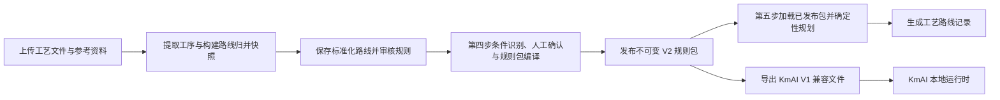
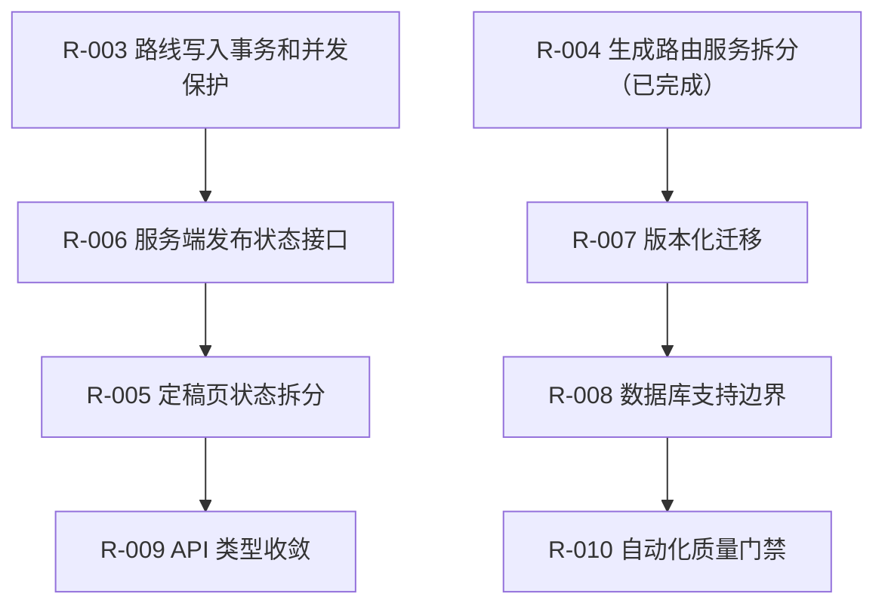

# ProcessMind 重构与优化跟踪

> **文档状态：** 当前代码基线已复核，R-003、R-004 已验证完成
>
> **复核日期：** 2026-08-07
>
> **代码基线：** `3e923f2`（`文档：复核重构与优化跟踪基线`）加当前工作区的 R-004 服务拆分
>
> **适用范围：** `process-plan-agent-api/`、`process-plan-agent-ui/`、`docs/`、Docker 和 Windows 离线交付脚本
>
> **复核方法：** 当前源码静态分析、后端全量 pytest、前端全量 Vitest、前端类型检查和生产构建

## 1. 文档目的与使用规则

本文记录当前工作区已经由代码和自动化验证支持的结论，以及后续重构的最小推进顺序。它不替代各条目的设计文档和实施计划，也不把设计稿视作已完成实现。

维护时遵循以下规则：

1. 只根据当前代码、已提交变更和实际测试输出更新状态。
2. 已完成条目必须同时具备实现证据和自动化验证；只有设计或计划时使用“待实施”。
3. 涉及 V2 规则包、KmAI V1 导出、数据库状态或工作流并发的修改，必须先明确协议和事务边界。
4. 未执行的 Docker、Python 3.11、离线包或端到端验证必须明确写为“未验证”，不能由静态阅读替代。
5. 不在本文中记录真实数据库、上传文件、`.env`、密钥或运行时输出。

R-003 与 R-004 的实施计划已随本次实现复核并保持一致；其余未跟踪文档不代表已编码或已验收。

### 1.1 状态定义

| 状态 | 含义 |
| --- | --- |
| 已验证完成 | 当前实现存在，验收行为已由本次或保留的自动化测试覆盖 |
| 部分完成 | 已拆出一部分边界或能力，但目标行为尚未完全收敛 |
| 待实施 | 方案和文件范围已明确，尚未开始对应代码变更 |
| 待设计 | 问题已确认，但 API、数据或兼容边界尚未定稿 |
| 未建立 | 尚无可执行方案或基础设施 |
| 未验证 | 代码或配置存在，但本次环境未能实际运行该验证 |

## 2. 当前架构基线

### 2.1 已验证的稳定基础

| 范围 | 当前实现与证据 |
| --- | --- |
| V2 契约和规则处理 | `rule_packages/contracts.py` 的 `StrictModel` 使用 `extra="forbid"`；编译、校验、模拟和兼容性测试分别由服务和路由承担。 |
| 条件审核边界 | 条件解析、本地/LLM 解析、状态转换、仓储和应用服务已分离；`routers/rule_packages.py` 在条件写路径持有工作流版本锁并负责提交或回滚。 |
| 已发布包有效性 | 条件实际变化会通过 `archive_published_rule_packages()` 归档当前包；V2 执行前再次比较已确认来源，发现漂移会归档并返回结构化 `409`。 |
| 发布与执行服务 | 发布准备和 V2 执行分别位于 `rule_packages/publishing.py`、`rule_packages/execution.py`；参数审核聚合和 V1/V2 生成选择分别位于 `param_audit.py`、`route_generation.py`，路由保留 HTTP 映射、事务和结果持久化。 |
| 参数问答策略交付 | `docs/配置模板/第五步参数问答策略.json` 是共享版本化来源；后端启动前严格校验，前端构建时导入，Dockerfile 和离线 staging 测试显式覆盖。 |
| KmAI V1 兼容导出 | `kmai_export.py` 已分为上下文、因素、条件和路线模块；固定导出四个 V1 文件，并限制条件组合数量和条件对象数量。 |

### 2.2 重要边界

- ProcessMind 是规则生产端。它通过 ZIP 中的 `kmai-v1/` 文件与 KmAI 交接，不 import KmAI 源码，也不直接调用 3DMPS。
- 兼容导出的固定文件为 `factor_schema.json`、`factor_expansion_rules.json`、`route_catalog.json`、`route_rules.json`；交接时必须保留 KmAI 端已有的 `group_match_rules.json`。
- `manual_override` 因素只能由 KmAI 输入中的 `manual.factor_overrides` 提供，不能从来源字段自动推断。
- `all` / `any` 展开默认限制为 `10000` 个组合和 `100000` 个条件对象，配置名为 `PROCESSMIND_KMAI_MAX_COMBINATIONS` 与 `PROCESSMIND_KMAI_MAX_CONDITION_OBJECTS`。

## 3. 本次验证基线

| 验证项 | 实际命令 | 结果 |
| --- | --- | --- |
| 后端全量测试 | 在 `process-plan-agent-api/` 执行 `py -3.14 -m pytest -q` | `323 passed, 1 skipped, 1 warning`，耗时 `23.62s` |
| 前端全量测试 | 在 `process-plan-agent-ui/` 执行 `npm.cmd test` | `25` 个测试文件、`125 passed` |
| 前端类型检查与生产构建 | 在 `process-plan-agent-ui/` 执行 `npm.cmd run build` | 成功，`vue-tsc -b` 通过，Vite 转换 `1826` 个模块 |

### 3.1 已知验证限制

1. 本次使用本机 Python `3.14.5`；Dockerfile 使用 `python:3.11-slim`，本次未在 Python 3.11 上运行测试。
2. 本机未发现 `docker` CLI，未执行 `docker compose build api web` 或容器健康检查。R-002 的 Docker COPY 仅经过源码级和测试级验证。
3. 仓库中未发现 `.github/workflows`，且本机没有可用的 `ruff`、`mypy` 命令；当前没有已执行的后端静态检查、覆盖率门禁或 CI 矩阵。
4. 后端 pytest 的唯一警告来自 FastAPI/Starlette TestClient 对 httpx 的迁移弃用提示；当前不影响 323 个通过用例，但应由 R-010 给出升级结论。

## 4. 跟踪总表

| ID | 优先级 | 状态 | 当前结论 | 下一道验收门 |
| --- | --- | --- | --- | --- |
| R-001 | P0 | 已验证完成 | 条件变化和执行期来源漂移都会使已发布 V2 包不可执行 | 保持回归覆盖，不扩展为前端自行判定 |
| R-002 | P0 | 已验证完成，Docker 未验证 | 参数问答策略已有单一交付来源和启动期校验 | 在有 Docker 的环境实际构建 API/Web 镜像 |
| R-003 | P1 | 已验证完成 | 路线归并、标准化路线保存和规则审核由路由统一持锁、提交与回滚，旧页面稳定返回结构化 `409` | 保持原子性与版本冲突回归覆盖 |
| R-004 | P1 | 已验证完成 | 参数审核聚合及 V1/V2 路线生成已移至应用服务；`generate.py` 只保留锁、HTTP 映射和生成记录持久化 | 保持 V1/V2、无有效包 `409` 和工作流失效回归覆盖 |
| R-005 | P1 | 部分完成 | 已有多个 composable；`FinalizeView.vue` 仍为 1924 行状态协调器 | 将工作区、条件队列、发布状态和冲突处理继续分离 |
| R-006 | P1 | 待设计 | 服务端没有统一的发布可执行状态和过期原因只读接口 | 后端成为状态与阻塞原因的唯一事实来源 |
| R-007 | P2 | 部分具备 | 已有 `schema_migrations` 表和启动安全测试，但维护逻辑仍在每次启动执行 | 改为有序、可审计、可恢复的版本化迁移 |
| R-008 | P2 | 待设计 | 当前实际依赖 SQLite；非 SQLite URL 不会被明确拒绝 | 明确只支持 SQLite，或单独规划多数据库迁移 |
| R-009 | P2 | 部分具备 | 已有工作流版本字段；前端仍保留大量手写 DTO 和 `Record<string, any>` | 收敛状态枚举和前后端 API 类型校验 |
| R-010 | P2 | 未建立 | 有本地测试与构建入口，但没有 CI、静态检查、覆盖率、Docker 或端到端门禁 | 建立分层质量门禁并实测交付链 |

## 5. 条目明细

### R-001 条件变化后发布包的服务端失效与执行校验

- **优先级：** P0
- **状态：** 已验证完成
- **相关提交：** `3dc6203`、`198eea2`、`b126bcb`

#### 已完成范围

1. `condition_review_service.py` 在条件草稿、解析开始、确认和人工设定产生实际语义变化后调用 `archive_published_rule_packages()`；无变化的写入不会无条件归档。
2. `execution.py` 在加载已发布 V2 包后调用 `require_confirmed_user_rule_sources()`；确认来源漂移时归档当前包并抛出领域异常。
3. `generate.py` 捕获该异常后只提交归档状态，并以稳定错误码 `published_rule_package_changed` 返回 `409`；不创建生成记录。
4. `process_identity.py` 统一路线段内部 ID 与稳定导出工序 ID 的映射，阻止不唯一工序引用进入发布或审核链路。
5. `condition_review_repository.py` 将 SQLite 回读的时间戳统一序列化为 UTC，避免时区偏移导致规则包内容判断误差。

#### 验收证据

- 条件审核、发布生命周期、执行期防御和工作流失效均有对应 pytest，主要位于 `test_condition_review_service.py`、`test_condition_review_repository.py`、`test_rule_package_lifecycle.py`、`test_generate_v2_production.py`、`test_workflow_invalidation.py`。
- 本次后端全量测试通过：`308 passed, 1 skipped, 1 warning`。

#### 保留边界

- 路线归并、标准化路线保存和第三步规则审核的事务统一不属于本条目，由 R-003 处理。
- 页面仍会做发布包新鲜度展示；跨页面、直接 API 调用的统一状态聚合由 R-006 处理。

### R-002 参数问答策略的单一来源与交付一致性

- **优先级：** P0
- **状态：** 已验证完成，Docker 实构建未验证
- **相关提交：** `dae10b1`

#### 已完成范围

1. 策略已迁移至 `docs/配置模板/第五步参数问答策略.json`，当前版本为 `1.0.0`。
2. 后端通过 `app.core.paths.PARAM_QUESTION_STRATEGY_PATH` 读取；`load_param_question_strategy()` 对文件不存在、非法 JSON 和结构不合法提供明确错误。
3. `app.main` 的 lifespan 在创建运行时状态前强制校验策略，避免 API 启动后才静默使用不同回退逻辑。
4. 前端 `src/config/paramQuestionStrategy.ts` 构建时导入同一 JSON；Docker API、Docker Web 和离线 staging 都有显式 COPY/包含断言。

#### 验收证据

- `test_param_question_strategy.py`、`test_delivery_config.py`、`test_offline_package_safety.py` 已纳入本次全量 pytest。
- 本次前端全量 Vitest 和生产构建通过。

#### 保留边界

- Dockerfile 的内容已由测试断言，但镜像拉取、构建、健康检查和容器内实际读取尚未执行，不能标记为 Docker 运行验证通过。

### R-003 派生路线写操作的事务与工作流版本统一

- **优先级：** P1
- **状态：** 已验证完成
- **依赖：** R-001 已完成
- **相关文档：** [设计](superpowers/specs/2026-08-06-r003-route-write-transaction-design.md)、[实施计划](superpowers/plans/2026-08-06-r003-route-write-transaction.md)

#### 已完成范围

1. `SaveNormalizedSupersetRouteRequest` 和 `MergeSuggestionReviewRequest` 已加入 `expected_workflow_revision`；前端保存、单项/批量审核和改名请求均发送当前项目版本。
2. `normalized-superset-route/save`、`segment-rule-reviews` 和 `merge-suggestions/review` 均在任何写入前调用 `acquire_workflow_revision()`，成功路径由路由一次提交，所有异常路径回滚并保留既有 HTTP 语义。
3. `route_analysis.py` 和 `route_merge/workspace.py` 的相关服务只执行查询、ORM 写入、`flush()` 和必要的 `refresh()`；不再终止外层事务。
4. 会重建归并快照或迁移旧审核数据的读取路由显式提交缓存性写入，避免依赖服务层隐式提交。
5. `ExtractView.vue` 从当前项目和工作流重置信号维护版本令牌，并注入路线归并 composable。

#### 验收证据

- 新增回归覆盖调用方回滚、三类旧版本写请求的结构化 `409`、保存失败时快照回滚，以及当前版本规则审核持久化。
- 后端聚焦验证：`27 passed, 1 warning`；后端全量：`313 passed, 1 skipped, 1 warning`。
- 前端 API 回归：`4 passed`；前端全量 Vitest：`25` 个测试文件、`125 passed`；`npm.cmd run build` 成功，`vue-tsc -b` 通过，Vite 转换 `1826` 个模块。
- `route_analysis.py` 与 `route_merge/workspace.py` 的 `commit/rollback` 搜索无匹配，`git diff --check` 通过。

#### 保留边界

- 未改变规则包 JSON、KmAI V1 ZIP、内容哈希、成功响应字段或工作流版本递增规则；全量回归通过。
- Docker、Python 3.11、离线包、静态检查和 CI 仍沿用本次验证限制，未因 R-003 获得额外运行时验证。

#### 完成标准

- [x] 标准化路线保存、归并建议审核、第三步规则审核都携带并校验真实工作流版本。
- [x] 相关服务没有 `commit()` 或 `rollback()` 外层事务。
- [x] 旧页面收到结构化 `409`，且没有新增路线版本、半更新快照或部分审核记录。
- [x] 正常响应、V2 规则包和 KmAI V1 ZIP 语义不变。
- [x] 后端聚焦/全量、前端 Vitest、生产构建均通过。

### R-004 `generate.py` 剩余应用服务拆分

- **优先级：** P1
- **状态：** 已验证完成
- **相关文档：** [实施计划](superpowers/plans/2026-08-07-r004-generate-route-service-split.md)

#### 已完成范围

- 发布准备和 V2 执行已移至 `rule_packages/publishing.py` 与 `rule_packages/execution.py`。
- `param_audit.py` 负责样本统计、参数审核答案读取、待确认问题、LLM 问题增强、稳定/待确认/数据问题状态和审核概览；不依赖 FastAPI，也不提交事务。
- `route_generation.py` 负责输入归一化、当前发布包及指纹读取、V1/V2 选择、V2 规划和旧规则回退，并以类型化结果返回步骤及规则包元数据；不提交或回滚外层事务。
- `routers/generate.py` 只负责工作流版本锁、领域异常到 HTTP 的映射、`GeneratedRoute` 写入、项目状态更新、提交和 `GenerateResponse` 包装。来源漂移时仍由路由提交归档状态后返回结构化 `409`。
- 无有效已发布包仍返回 `409`，不会再回退到第二步提炼结果；强制 V1 引擎、旧客户端未提交指纹和既有 V1/V2 输出字段保持兼容。

#### 验收证据

- 新增 `test_param_audit_service.py` 覆盖稳定、待确认和数据问题分支；新增 `test_route_generation_service.py` 覆盖 V2 领域结果、强制 V1 路径、旧请求字段归一化、无效包版本和已发布包加载。
- 聚焦回归：`py -3.14 -m pytest -q tests/test_param_audit_service.py tests/test_route_generation_service.py tests/test_generate_v2_production.py tests/test_rule_package_execution.py`，结果 `32 passed, 1 warning`；覆盖参数审核服务、路线生成服务、V2 API、路线失效流程及 V1 已发布包成功/损坏分支。
- 后端全量：`323 passed, 1 skipped, 1 warning`。
- `py -3.14 -m compileall -q app/routers/generate.py app/services/param_audit.py app/services/route_generation.py` 通过；`git diff --check` 通过。

#### 保留边界

- 本条目未修改前端、数据库结构、V2 规则包、KmAI V1 ZIP、内容哈希或发布生命周期；因此未重新执行前端 Vitest/构建，也未获得 Docker、Python 3.11、离线包或端到端新增验证。
- 参数审核原有 HTTP 入口不在当前路由集合中；本次只将其遗留聚合逻辑迁入服务并补齐直接回归，未新增 API 或页面行为。

#### 完成标准

- [x] 参数审核聚合位于应用服务，并有稳定、待确认和数据问题分支测试。
- [x] V1/V2 选择和领域结果位于路线生成服务，路由仅保留锁、HTTP 映射和持久化。
- [x] 无有效已发布包仍返回 `409`，且代码注释不再描述已废弃的第二步静默回退。
- [x] V2 输入、发布包指纹、来源漂移归档和强制 V1 路径的现有回归通过。
- [x] 后端聚焦、全量和差异格式检查通过。

### R-005 `FinalizeView.vue` 状态与副作用继续拆分

- **优先级：** P1
- **状态：** 部分完成

#### 当前情况

现有代码已提取 `useFinalizeRulePackagePublish`、`useFinalizedRulePackageDownload`、`useRulePackagePublishReview`、`useFinalizeDrafts` 等 feature-scoped composable。但 `FinalizeView.vue` 仍有 `1924` 行，继续同时协调工作区加载、条件识别队列、批量审核、草稿、发布、下载、哈希比较、过期展示和工作流冲突。

页面加载时还会重新编译当前草稿并与已发布包 `content_hash` 比较，以判断“已过期”。该展示逻辑有价值，但不应成为服务端发布有效性的替代品。

#### 下一步

1. 提取 `useFinalizeWorkspace`，集中加载项目、路线、工序、规则包和标准因子目录。
2. 提取 `useConditionReviewQueue`，集中单条/批量解析、确认、取消和请求过期保护。
3. 提取 `useFinalizeWorkflowConflict`，统一 409、重载和重置后的状态清理。
4. 保持 feature-scoped composable 模式；没有跨路由长期共享状态的证据前，不默认引入 Pinia。

### R-006 服务端发布状态与过期原因接口

- **优先级：** P1
- **状态：** 待设计
- **依赖：** R-001 已完成；建议在 R-005 前或并行定稿

#### 当前问题

后端目前提供“最新已发布包”“包列表”和“下载”接口，但没有一个聚合接口统一表达 `can_publish`、`can_generate`、当前包是否可执行和稳定的阻塞原因。`FinalizeView.vue` 仍通过本地草稿重新编译和哈希比对推导过期状态。

#### 目标接口能力

- 当前发布包 ID、版本、schema 版本、内容哈希和状态。
- 当前路线版本、工作流版本及包是否可执行。
- 稳定的阻塞/过期原因代码，而不是依赖中文消息匹配。
- 待确认规则、无效因素绑定和 KmAI 兼容性摘要。

该接口必须只读，复用发布和执行服务，不能在前端复制规则有效性算法。

### R-007 启动期数据库维护改为版本化迁移

- **优先级：** P2
- **状态：** 部分具备

#### 当前情况

`db_schema_maintenance.ensure_project_schema()` 已具备启动安全测试、`schema_migrations` 表和部分保护性迁移逻辑。但它在每次启动中继续执行列补齐、回填、索引维护、发布包规范化和历史 KmAI 映射表处理。`schema_migrations` 当前只记录了特定历史清理，尚未成为有序迁移的统一事实来源。

#### 下一步

1. 将建表、增列、一次性回填和数据修复拆为显式、有序、仅执行一次的迁移函数。
2. 每项迁移记录名称、版本、时间和结果；失败时在同一事务中回滚并报告迁移名称。
3. 将重型审计和修复移至显式维护命令，并提供备份与恢复说明。
4. 使用全新库和至少一个历史库快照验证升级与重复启动幂等性。

### R-008 明确 SQLite 支持边界

- **优先级：** P2
- **状态：** 待设计

#### 当前问题

`database.py` 对 SQLite 配置 WAL、外键和超时，但 `ensure_project_schema()` 仍无条件使用 `PRAGMA table_info`、`sqlite_master`、SQLite 部分索引和 DDL。非 SQLite 的 `DATABASE_URL` 没有在启动前被明确拒绝，可能在维护逻辑中以不直观的数据库错误失败。

#### 推荐决策

近期明确支持 SQLite：启动时验证 `DATABASE_URL` 并给出可操作错误；README、环境模板和 Docker 说明同步声明。未来若需要 PostgreSQL，应单独建立数据库兼容性和迁移项目，不在当前重构中顺带支持。

### R-009 工作流状态与前后端 API 类型收敛

- **优先级：** P2
- **状态：** 部分具备

#### 当前情况

工作流版本已进入部分 Pydantic 请求模型和前端 API 调用，但状态仍大量使用字符串，前端 `api/extract.ts` 保留多处 `Record<string, any>`，没有 OpenAPI 到前端 DTO 的生成或校验脚本。当前前端生产构建能检查 TypeScript 内部一致性，不能保证服务端字段漂移被自动发现。

#### 下一步

1. 在后端集中定义项目、任务、审核和发布状态的转换规则；数据库可继续保存 `VARCHAR`，避免无必要迁移。
2. 为 V2、发布状态和工作流响应建立可复用前端 DTO，逐步替代开放式 `any`。
3. 用 OpenAPI 生成或契约校验驱动前端类型；对 `can_publish`、`can_generate` 等能力字段只接受后端事实来源。

### R-010 CI、静态检查、覆盖率和交付冒烟测试

- **优先级：** P2
- **状态：** 未建立

#### 当前缺口

当前本地 pytest、Vitest 和生产构建均可运行，但仓库未见 CI 工作流，前端脚本只有 `test` 和 `build`，后端开发依赖未包含 Ruff、Mypy 或覆盖率门禁。本机也没有 Docker CLI，因此镜像构建和离线交付主链未在本次复核中运行。

#### 最小门禁建议

| 层级 | 最低验证 |
| --- | --- |
| 后端 | Python 3.11 与 3.13 全量 pytest、Ruff、关键规则包模块覆盖率 |
| 前端 | Node 20、Vitest、`vue-tsc -b`、Vite 生产构建 |
| Docker | API/Web 镜像构建、健康检查、共享策略文件存在性 |
| Windows 离线包 | staging 安全扫描、允许清单、启动和健康检查冒烟 |
| 端到端 | 上传到发布再生成；修改条件后旧包被拒绝执行 |

## 6. 推荐推进顺序

R-003 和 R-004 已完成，后续状态接口及页面拆分不应绕过既有写入原子性、发布包有效性和版本冲突边界。R-005 仍应在 R-006 的状态契约定稿后推进；R-010 负责把已完成条目的回归证据固化为可重复门禁。

## 7. 单项完成定义

一个条目只有同时满足以下条件才能标记为“已验证完成”：

1. 代码边界、数据影响和 V2/KmAI 兼容性已明确。
2. 行为改变具备聚焦自动化测试；高风险条目同时具备全量回归。
3. 前端相关改动通过 Vitest 与 `npm.cmd run build`。
4. Docker、离线包或跨版本运行时若未实测，状态仍保留“未验证”。
5. 设计文档、实施计划、README 和本文的结论保持一致；代码注释不得描述已废弃的行为。
6. 使用 `git diff --check` 和 `git status --short` 确认无格式错误及无意外产物。

## 8. 变更记录

| 日期 | 范围 | 结论或证据 |
| --- | --- | --- |
| 2026-08-06 | R-001 | 条件来源变化归档当前发布包；V2 执行期来源漂移返回 409 并阻止生成。 |
| 2026-08-06 | R-002 | 参数问答策略迁移为共享交付文件，后端启动期校验，前端/Docker/离线 staging 复用。 |
| 2026-08-07 | R-003 完成后基线复核 | 更新基线至 `b126bcb` 加未提交 R-003 修复；后端 `313 passed, 1 skipped, 1 warning`，前端 `125 passed`，生产构建成功；Docker、Python 3.11、静态检查和 CI 未验证。 |
| 2026-08-07 | R-003 | 路由统一获得工作流版本锁并负责事务；服务层只 flush/refresh；旧版本请求返回结构化 `409`，失败写入回滚快照。 |
| 2026-08-07 | R-004 | 参数审核聚合移至 `param_audit.py`，V1/V2 生成选择移至 `route_generation.py`，路由保留锁、HTTP 映射和持久化；后端全量 `323 passed, 1 skipped, 1 warning`。 |
