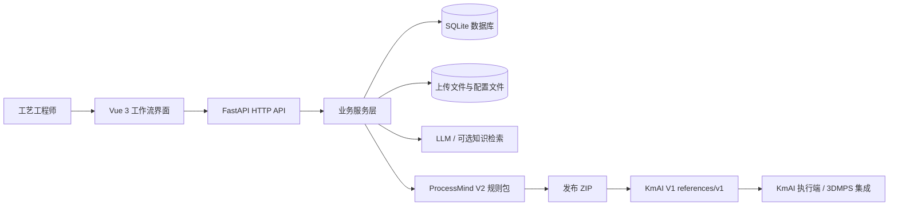
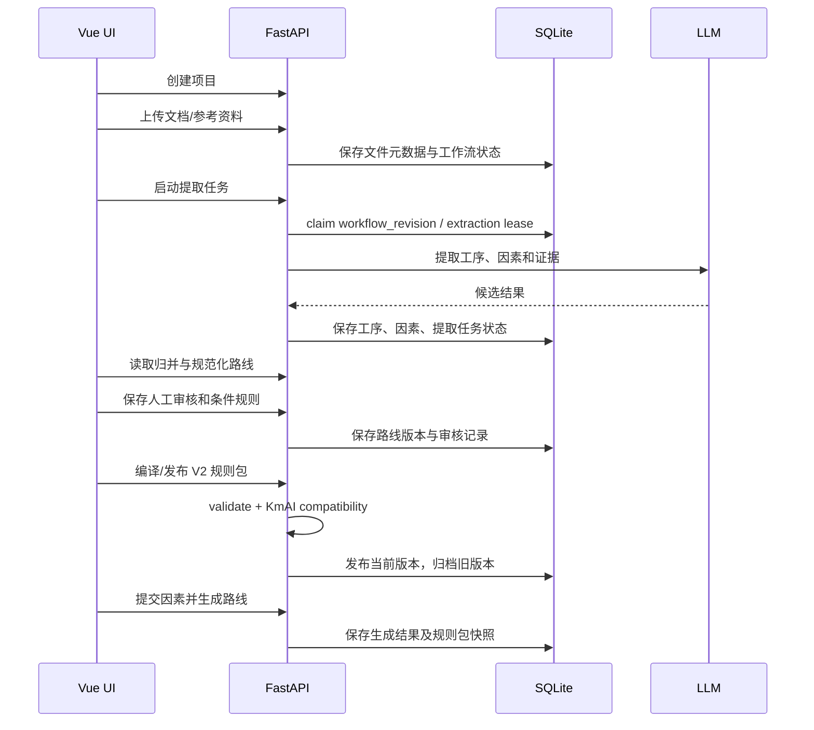

# ProcessMind 项目架构与代码分析报告

> 分析日期：2026-08-12
> 分析范围：`process-plan-agent-api`、`process-plan-agent-ui`、规则包 V2/KmAI V1 导出、数据库迁移、Docker/Windows 运行脚本和现有测试。
> 文档性质：当前实现的代码分析，以及明确标注的改进建议。

## 1. 结论摘要

ProcessMind 是一个“工艺知识生产与规则发布平台”。它把工艺规程、参考资料和人工确认结果整理成可审计的工艺路线与规则包，再提供 V2 规则包模拟、发布和 KmAI V1 兼容导出。

它不是 3DMPS 桌面端，也不是 KmAI 的执行运行时。两者通过导出的 JSON/ZIP 协议交接。

当前版本已经具备较完整的业务闭环：

- FastAPI 后端、Vue 3 前端和 SQLite 本地数据层已经稳定分层。
- 规则包具备编译、验证、测试用例执行、哈希、发布、归档和兼容性检查。
- 前后端状态枚举和关键 OpenAPI 属性有契约检查。
- 上传文件具备类型、大小、内容签名和压缩比检查。
- 主要质量门禁已通过，但 Docker、真实浏览器端到端流程和 Python 3.11 实机矩阵仍需单独验证。

最需要优先处理的不是继续扩展页面功能，而是后台提取任务的多进程可靠性、规则逻辑的前后端单一事实来源，以及规则包状态聚合和浏览器流程的测试深度。

## 2. 系统边界



### 2.1 ProcessMind 负责的内容

1. 创建项目并维护项目工作流状态。
2. 上传工艺规程和参考资料。
3. 调用大模型提取工序、因素和证据。
4. 合并、规范化和审核路线。
5. 将人工确认的条件编译为规则包 V2。
6. 校验规则包、运行测试用例、模拟路线。
7. 发布、归档和失效规则包。
8. 导出 KmAI V1 兼容文件。

### 2.2 ProcessMind 不负责的内容

- 不直接 import KmAI 源码。
- 不直接调用 3DMPS 桌面 API。
- 不把实时 HTTP API 作为 ProcessMind 与 KmAI 的正式协议。
- 不应把开发目录中的数据库、上传文档或 `.env` 当作交付物。

## 3. 代码结构

| 目录 | 职责 |
|---|---|
| `process-plan-agent-api/app/main.py` | FastAPI 应用、生命周期、CORS、路由注册 |
| `process-plan-agent-api/app/routers/` | 请求校验、依赖注入、异常到 HTTP 响应的编排 |
| `process-plan-agent-api/app/services/` | 文档解析、提取、路线合并、参数问答、规则包和路线生成 |
| `process-plan-agent-api/app/services/rule_packages/` | V2 契约、编译、验证、执行、发布、归档、KmAI 导出 |
| `process-plan-agent-api/app/models/models.py` | SQLAlchemy ORM 数据模型 |
| `process-plan-agent-api/app/services/db_schema_migrations.py` | SQLite 版本化迁移和历史校验 |
| `process-plan-agent-api/knowledge/` | 工艺路线知识与规则资料 |
| `process-plan-agent-api/prompt_parts/` | 分阶段提示词片段 |
| `process-plan-agent-ui/src/views/` | 五步工作流页面和设置页 |
| `process-plan-agent-ui/src/components/` | 页面级交互组件 |
| `process-plan-agent-ui/src/composables/` | 前端工作区、缓存、请求竞态和状态逻辑 |
| `process-plan-agent-ui/src/api/` | Axios API 客户端、DTO、状态类型和规则包 API |
| `docs/` | 设计、迁移、实施方案和本分析报告 |
| `docker/`、`Dockerfile.*` | Docker 交付运行配置 |
| `scripts/` | Windows/macOS 运行、离线打包、数据库维护和契约检查 |

后端约 124 个 Python 文件、约 2.67 万行；前端约 139 个 TypeScript/Vue 文件、约 3.92 万行。大型文件主要集中在提取页面、规则定稿页面、参数审计和问题树逻辑，说明业务已较丰富，但模块边界仍有继续收敛空间。

## 4. 端到端业务流程



### 4.1 项目工作流状态

项目状态集中定义于 [status.py](../process-plan-agent-api/app/contracts/status.py)：

`CREATED -> UPLOADED -> EXTRACTING -> ROUTE_SET_READY -> GENERATED`

异常状态包括 `EXTRACT_ERROR` 和历史兼容状态 `FAILED`。

页面路由由 [router/index.ts](../process-plan-agent-ui/src/router/index.ts) 定义：

`/upload -> /extract -> /analysis -> /finalize -> /generate`

页面通过 `project_id` 查询参数和浏览器本地存储保持当前项目上下文。前端缓存和请求竞态控制主要位于 `workflowDataCache.ts`、`workflowResetState.ts` 和各页面 composable。

## 5. 后端分析

### 5.1 应用入口与配置

[main.py](../process-plan-agent-api/app/main.py) 在生命周期启动时执行：

1. 加载参数问题策略。
2. 创建数据库表并运行迁移。
3. 预加载内置工艺知识缓存。
4. 注册文档、提取、规则包、生成、项目和设置路由。

[database.py](../process-plan-agent-api/app/database.py) 使用 SQLAlchemy AsyncEngine，启动前通过 `make_url()` 验证 `DATABASE_URL`，当前只接受 `sqlite+aiosqlite`。SQLite 连接启用 WAL、外键和忙等待配置。

这是一个合理的本地运行边界：配置错误在引擎创建前暴露，而不是运行到第一次请求时才失败。

### 5.2 API 路由职责

| 路由模块 | 主要接口 | 业务作用 |
|---|---|---|
| `documents.py` | `/api/documents/*` | 上传、预览、PDF 页面渲染、参考资料维护 |
| `projects.py` | `/api/projects/*` | 项目创建、列表、规则引擎选择、级联删除 |
| `extract.py` | `/api/extract/*` | 提取任务、工序、归并建议、规范化路线、审核和历史规则包 |
| `rule_packages.py` | `/api/extract/finalized-rule-packages/*` | 条件审核、V2 编译、验证、模拟、KmAI 兼容性测试 |
| `generate.py` | `/api/generate/*` | 读取因素 schema、基于已发布规则包生成路线 |
| `settings.py` | `/api/settings/*` | LLM 配置、连接测试、模型列表 |

整体上路由层没有承载大量规则计算，职责边界是健康的。需要继续避免把新的规则语义塞入 Vue 页面或路由函数。

### 5.3 数据模型与数据所有权

核心数据可以分为五组：

1. 项目和任务：`Project`、`ExtractionTaskState`。
2. 输入资料：`Document`、`Reference`。
3. 提取结果：`Operation`、`Factor`、`DocumentOperationDetail`。
4. 路线审核：`RouteMergeSnapshot`、`NormalizedRouteVersion`、因素审核和规则审核。
5. 规则包和执行结果：`FinalizedRulePackage`、`GeneratedRoute`。

工作流失效由 [project_workflow_lifecycle.py](../process-plan-agent-api/app/services/project_workflow_lifecycle.py) 统一处理。它会增加 `workflow_revision`，删除或重置派生数据，并将已发布规则包归档。这比在多个路由中各自清理数据更容易维持一致性。

数据库层目前仍有明显的“业务代码保证一致性”特征：大量状态是字符串，多个 JSON 结构存储在 `Text` 字段，部分外键允许为空。对于当前本地单用户场景可以接受，但多用户或长期运行后会增加脏数据风险。

### 5.4 提取任务

提取任务由 [extraction_pipeline.py](../process-plan-agent-api/app/services/extraction_pipeline.py) 和 [extraction_tasks.py](../process-plan-agent-api/app/services/extraction_tasks.py) 共同实现：

- 先检查 LLM 配置。
- 通过项目状态条件更新竞争提取任务。
- 失效第二步及其派生数据。
- 使用 `asyncio.create_task()` 在当前进程后台执行。
- 任务状态同时写入内存字典和 `extraction_task_states` 表。
- 任务超过 10 分钟无更新时被判定为过期。

这个设计对单进程桌面部署是实用的，但要特别注意：真正的任务对象、进程内锁和运行集合仍是内存状态。数据库中的任务状态只能帮助恢复显示，不能完整代表任务是否仍在运行。

## 6. 规则包 V2 与 KmAI V1

### 6.1 V2 规则包结构

V2 契约位于 [contracts.py](../process-plan-agent-api/app/services/rule_packages/contracts.py)，至少包含：

- manifest 和项目范围。
- 输入 schema。
- 工序目录和工步。
- 条件规则与工序关系。
- 测试用例。
- 验证报告和兼容性报告。

### 6.2 校验链路

规则包发布前主要经过：

1. Pydantic 严格模型解析。
2. 字段、工序、规则、关系和测试用例 ID 去重。
3. 引用存在性和自引用检查。
4. 工序依赖环检查。
5. 主线工序、互斥规则和优先级冲突检查。
6. 用户规则来源、确认人和确认时间检查。
7. 输入值校验与测试用例执行。
8. KmAI V1 导出兼容性检查。

核心验证实现位于 [validator.py](../process-plan-agent-api/app/services/rule_packages/validator.py)，发布逻辑位于 [publishing.py](../process-plan-agent-api/app/services/rule_packages/publishing.py)，执行逻辑位于 [execution.py](../process-plan-agent-api/app/services/rule_packages/execution.py)。

### 6.3 发布与失效

发布采用项目内版本号和唯一的 `published` 状态索引。路线版本、确认来源、规则内容或兼容性变化后，旧包会被标记为 `superseded` 或 `archived`，生成接口只允许使用当前有效发布包。

状态聚合由 [status.py](../process-plan-agent-api/app/services/rule_packages/status.py) 完成，向前端返回：

- `can_publish`
- `can_generate`
- `package_executable`
- blockers
- 审核统计
- KmAI 兼容性统计

这是当前系统的重要控制面，建议优先提高其独立测试覆盖率。

### 6.4 KmAI 导出风险边界

KmAI 导出由 `kmai_export*.py` 负责，输出四个 V1 文件：

```text
kmai-v1/factor_schema.json
kmai-v1/factor_expansion_rules.json
kmai-v1/route_catalog.json
kmai-v1/route_rules.json
```

`all`/`any` 条件会展开为组合。代码已有组合数和条件对象数上限，默认分别为 `10000` 和 `100000`。这可以防止规则规模失控，但仍建议把导出规模、耗时和拒绝原因纳入发布观测指标。

## 7. 前端分析

### 7.1 页面和状态组织

前端采用 Vue 3、Vite、Element Plus、Axios 和 Vue Router。页面按工作流拆分，复杂状态下沉到 composable：

- 上传页：项目、文档、参考资料和任务状态。
- 提取页：工序提取和路线归并。
- 分析页：问题树、证据和样本对比。
- 定稿页：规则审核、标准因子绑定和发布审查。
- 生成页：因素输入、规则包执行和路线输出。

前端已经有请求版本守卫和缓存失效机制，能够降低页面切换时旧请求覆盖新状态的风险。

### 7.2 当前前端的主要结构性问题

`ExtractView.vue`、`FinalizeView.vue`、`AnalysisView.vue` 都较大，部分纯业务判断仍位于前端，例如：

- 判断工序是主线、条件还是关系规则。
- 根据字段和工序生成默认测试用例。
- 规范化条件树并补充自定义标签值。

这会造成一个长期风险：后端验证通过的规则语义，可能和前端提交前展示的语义不一致。前端可以保留“交互辅助判断”，但发布前的最终规则应由后端重新解析、规范化和校验。

### 7.3 API 契约

状态枚举由后端 [status.py](../process-plan-agent-api/app/contracts/status.py) 定义，前端生成文件为 [generated/status.ts](../process-plan-agent-ui/src/api/generated/status.ts)。契约检查脚本会验证 OpenAPI 中的 JSON 类型、枚举引用、required、nullable 和 default。

这部分是成熟的做法，但目前主要覆盖结构契约，仍建议增加一组真实接口响应的 contract fixtures，特别是规则包状态、提取任务状态和生成响应。

## 8. 安全与运维分析

### 8.1 已有防护

- 上传文件使用随机存储名，避免直接使用用户文件名作为路径。
- 上传限制文件数量、单文件大小和批量总大小。
- PDF、Office、JSON 会做内容格式检查。
- Office 压缩包检查解压大小和压缩比。
- API CORS 使用显式允许源，不允许任意网站读取本地 API。
- Docker Web 默认绑定 `127.0.0.1`。
- 离线打包脚本会扫描数据库、上传文件、`.env` 和疑似密钥。

### 8.2 需要关注的风险

1. 设置接口支持请求任意 LLM URL。若服务被部署到内网并开放给多个用户，模型连接测试和模型列表接口需要 SSRF 防护、认证和地址白名单。
2. LLM API Key 存储在独立 JSON 文件中，接口输出会脱敏，但磁盘文件本身仍是明文。
3. SQLite 适合本地单用户或低并发，不适合作为多实例高并发数据库。
4. Docker 镜像已固定部分版本，但当前仓库没有独立的依赖漏洞扫描或 SBOM 门禁。
5. 错误处理仍有多处宽泛 `except Exception`。这有利于不让后台任务直接崩溃，但可能隐藏异常类型、降低告警质量。

## 9. 测试与质量门禁

本次执行结果：

| 检查 | 结果 |
|---|---|
| 后端 Ruff | 通过 |
| 后端全量 pytest | `388 passed, 1 skipped` |
| 规则包覆盖率 | `86.54%`，高于 85% 门槛 |
| 前端 API 契约检查 | 通过 |
| 前端 Vitest | 30 个测试文件，144 项通过 |
| 前端生产构建 | 通过，转换 1830 个模块 |
| Python 依赖检查 | `pip check` 无冲突 |
| Docker 构建/启动 | 本次未执行 |
| Python 3.11 实机矩阵 | 本次未执行 |
| 浏览器端到端工作流 | 当前 CI 未形成完整门禁 |

当前测试强项是规则包纯逻辑、API 契约、数据库迁移和前端 composable。相对薄弱的是：

- 规则包状态聚合。
- 后台任务多进程/重启/超时恢复。
- 真实上传到发布再到生成的浏览器流程。
- 大文件、LLM 长耗时和 SQLite 锁竞争下的运行行为。

## 10. 分阶段改进建议

### 第一阶段：可靠性优先

1. 明确生产运行模式为单 worker，启动脚本和 Docker 命令中显式约束。
2. 为提取任务增加 `owner_id`、`lease_expires_at`、`heartbeat_at` 和 `attempt` 字段。
3. 任务启动、续租、完成和失败全部通过数据库条件更新确认所有权。
4. 增加“进程重启后任务恢复”和“双 worker 竞态”测试。
5. 对 `build_rule_package_status` 补齐全状态矩阵测试。

### 第二阶段：收敛规则事实来源

1. 将前端规则推导拆为纯展示辅助函数。
2. 由后端生成规范化条件树、默认测试用例和最终 V2 package payload。
3. 前端展示后端返回的校验问题，不重复实现发布规则。
4. 增加一组前后端共享的 golden rule fixtures。

### 第三阶段：交付和安全

1. 增加 Playwright 最小闭环：上传、提取、审核、发布、生成。
2. 增加旧页面冲突、规则包失效和任务中断的 UI 测试。
3. 对设置接口增加认证开关、URL scheme/host 白名单和内网地址拦截。
4. 将密钥存储改为环境变量或系统凭据存储，JSON 文件只保留非敏感配置。
5. 在 CI 增加依赖漏洞扫描、镜像扫描和 SBOM 产物。

### 第四阶段：可维护性

1. 将大型 Vue 页面继续拆成工作区、请求协调器和纯展示组件。
2. 将 `param_audit.py` 等大型服务按查询、规则计算、持久化拆分。
3. 减少宽泛异常捕获，统一错误码、日志字段和 trace/request id。
4. 为 JSON Text 字段建立统一序列化/反序列化边界，避免各处手工 `json.loads`。
5. 为核心实体补充数据库级 CHECK、唯一约束和非空约束。

## 11. 推荐的工程优先级

```text
P0  明确单 worker 约束，避免后台任务语义被误解
P1  数据库 lease/heartbeat + 多进程任务测试
P1  规则包状态聚合测试矩阵
P1  Playwright 真实闭环测试
P1  前后端规则 golden fixtures
P2  设置接口 SSRF/认证/密钥存储改造
P2  依赖漏洞扫描与镜像 SBOM
P3  大型模块拆分和统一 JSON 边界
```

## 12. 参考源码

- [应用入口](../process-plan-agent-api/app/main.py)
- [数据库配置](../process-plan-agent-api/app/database.py)
- [项目与工作流模型](../process-plan-agent-api/app/models/models.py)
- [工作流失效与版本控制](../process-plan-agent-api/app/services/project_workflow_lifecycle.py)
- [提取任务](../process-plan-agent-api/app/services/extraction_pipeline.py)
- [规则包契约](../process-plan-agent-api/app/services/rule_packages/contracts.py)
- [规则包验证器](../process-plan-agent-api/app/services/rule_packages/validator.py)
- [规则包发布](../process-plan-agent-api/app/services/rule_packages/publishing.py)
- [规则包执行](../process-plan-agent-api/app/services/rule_packages/execution.py)
- [规则包状态](../process-plan-agent-api/app/services/rule_packages/status.py)
- [KmAI 导出](../process-plan-agent-api/app/services/rule_packages/kmai_export.py)
- [前端路由](../process-plan-agent-ui/src/router/index.ts)
- [前端 DTO](../process-plan-agent-ui/src/api/dto.ts)
- [质量门禁](../.github/workflows/quality-gates.yml)
